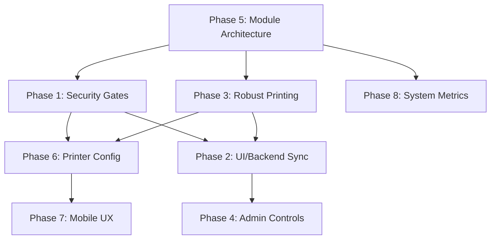

# 🖨️ Printing Automation — Phase-by-Phase Implementation Plan

> **Source:** `instructions/instruction_8.md` + `PROJECT_STATUS_REPORT.md`  
> **Total Phases:** 8 | **Estimated Tasks:** 31  
> **Dependency Order:** Phase 5 → Phase 1 → Phase 3 → Phase 6 → Phase 2 → Phase 4 → Phase 7 → Phase 8  
> *(Phase 5 is the architectural refactor that all other phases build on)*

---

## Dependency Graph

> **Why Phase 5 first?** The command registry and adapter pattern are foundational — every other phase calls shell commands or interacts with printer hardware. Building the clean architecture first means Phases 1/3/6/8 write code in the correct place from day one, avoiding a painful retroactive refactor.

---

## Phase 5 — Singular Module-Based Backend Architecture

**Goal:** Refactor backend into adapter pattern + centralized command registry.  
**Risk:** Highest-risk phase (refactoring working code). Must be done first to avoid double-work.  
**Prerequisite:** None.

### Task 5.1 — Centralized Shell Command Registry

| Item | Detail |
|:--|:--|
| **Create** | `server/src/commands/` directory |
| **Files** | `cups.commands.ts`, `hp.commands.ts`, `system.commands.ts` |
| **Action** | Extract all 28+ `execCommand()` calls from `printer.service.ts`, `supplies.service.ts`, `job.service.ts`, `wifi.service.ts`, `print.controller.ts` into typed, sanitized functions |
| **Examples** | `cups.cancelJob(id)`, `cups.printFile(path, opts)`, `cups.listPrinters()`, `hp.setupPrinter(uri)`, `hp.getLevels(name)`, `system.getPdfInfo(path)`, `system.getDiskUsage()` |
| **Security** | Add input sanitization to all functions — reject IDs/paths containing `;`, `|`, `&`, backticks |
| **Merge** | Consolidate duplicate `execWithTimeout()` from `supplies.service.ts` into `utils/exec.ts` |

### Task 5.2 — Printer Adapter Pattern

| Item | Detail |
|:--|:--|
| **Create** | `server/src/adapters/` directory |
| **Interface** | `IPrinterAdapter` with methods: `healthCheck()`, `getSupplies()`, `configure(name)` |
| **Adapters** | `HpLegacyAdapter.ts` — wraps `hp.commands.ts` calls |
| | `IppModernAdapter.ts` — wraps `cups.commands.ts` IPP calls |
| | `EpsonLegacyAdapter.ts` — wraps Epson USB calls |
| **Each adapter** | Implements the interface using the centralized command registry (NOT raw `exec()`) |

### Task 5.3 — Printer Factory

| Item | Detail |
|:--|:--|
| **Create** | `server/src/factories/printer.factory.ts` |
| **Logic** | Takes printer URI/model → returns correct `IPrinterAdapter` instance |
| **Matching** | `hp:/usb/` → `HpLegacyAdapter`, `ipp://` → `IppModernAdapter`, `usb://` + Epson → `EpsonLegacyAdapter` |

### Task 5.4 — Refactor Monolithic Services

| Item | Detail |
|:--|:--|
| **Modify** | `printer.service.ts` — replace inline commands with `cups.commands.*` calls |
| **Modify** | `supplies.service.ts` — replace `queryIpp/querySnmp/queryHpUsb/queryEpsonUsb/queryGenericUsb` with `factory.getAdapter(uri).getSupplies()` |
| **Modify** | `job.service.ts` — replace inline `cancel`/`hold`/`resume` with `cups.commands.*` |
| **Verify** | All existing features still work — fleet listing, supply display, job cancel/pause/resume |

---

## Phase 1 — Security Gates & Printer Availability

**Goal:** Block users when no printers are online; disable unsupported config options.  
**Prerequisite:** Phase 5 (commands registry for `cups.listPrinters()`).

### Task 1.1 — Backend: `GET /api/fleet/kiosk-status`

| Item | Detail |
|:--|:--|
| **Create** | New route + controller function in `printer.controller.ts` (or new `fleet.controller.ts`) |
| **Logic** | 1. Call `listPrinters()` to get all printer statuses |
| | 2. `isAcceptingJobs` = `true` if ≥1 printer is `idle` or `busy` |
| | 3. Aggregate `capabilities.json` for all *available* printers into `fleetCapabilities: { color: bool, duplex: bool }` |
| **Response** | `{ isAcceptingJobs: true, fleetCapabilities: { color: false, duplex: true } }` |
| **No auth** | This is a public kiosk endpoint — no JWT required |

### Task 1.2 — Frontend: DropZone Availability Gate

| Item | Detail |
|:--|:--|
| **Modify** | `DropZone.tsx` |
| **On mount** | Fetch `/api/fleet/kiosk-status` |
| **If offline** | Render full-screen blocking overlay: "Machine Offline / No printers available — please contact staff." |
| **Polling** | Start 5-second interval while offline. Instantly remove overlay when `isAcceptingJobs` becomes `true` |
| **If online** | Proceed normally (no polling needed) |
| **Store** | Save `fleetCapabilities` to `useUserPrintStore` for use by ConfigConsole |

### Task 1.3 — Frontend: ConfigConsole Capability Gating

| Item | Detail |
|:--|:--|
| **Modify** | `ConfigConsole.tsx` |
| **DO NOT** | Hide buttons — users think the UI is broken |
| **If `color: false`** | Render Color button as disabled (greyed out) + badge: "Not available at this shop" |
| **If `duplex: false`** | Same disabled state + badge on Double-Sided option |
| **Source** | Read `fleetCapabilities` from `useUserPrintStore` (populated in Task 1.2) |

---

## Phase 3 — Robust Printing Logic & Failure Recovery

**Goal:** Fix retry limits, add startup health sweep, admin force-refresh, better error UI.  
**Prerequisite:** Phase 5 (adapters for `healthCheck()`, command registry).

### Task 3.1 — Fix Job Retry Limits

| Item | Detail |
|:--|:--|
| **Modify** | `printMaster.queue.ts` — change `attempts: 4` → `attempts: 3` |
| **Modify** | `printMaster.worker.ts` — change `attemptedPrinters.length >= 3` → `>= 2` |
| **Result** | 1 initial attempt + 2 retries max |

### Task 3.2 — Digital Startup Health Sweep

| Item | Detail |
|:--|:--|
| **Modify** | `server.ts` — add boot sequence after Express starts |
| **NO test prints** | Strictly forbidden per instruction |
| **Legacy USB** | Digital probe via `lsusb \| grep "Vendor:Product"` (from `system.commands.ts`) |
| **IPP printers** | Digital probe via `ipptool -tv "<uri>" get-printer-attributes.test` (from `cups.commands.ts`) |
| **On probe pass** | Run `adapter.getSupplies()` to cache fresh data in Redis |
| **On probe fail** | Flag printer as `flagged` in Redis, skip supply check |
| **Store** | Redis key per printer: `printer:<name>:health` → `healthy` or `flagged` |

### Task 3.3 — Admin "Force Refresh" Button

| Item | Detail |
|:--|:--|
| **Create** | `POST /api/printers/:name/refresh` (auth-protected) |
| **Backend** | 1. Delete Redis cache for that printer. 2. Run same digital probe as Task 3.2. 3. If pass → run supply check → set `healthy`. If fail → set `flagged`. 4. Return result |
| **Frontend** | Add "Force Refresh" / "Check Health" button to each printer card in `Fleet.tsx` with per-card loading spinner |
| **On complete** | Update status badge on the card instantly |

### Task 3.4 — Simplified User Hardware Error UI

| Item | Detail |
|:--|:--|
| **Modify** | `JobTracker.tsx` `failed` state |
| **Message** | "Hardware Error. We have paused your job. Please notify the shop staff." |
| **NO** | Digital "Contact Admin" messaging feature |
| **Button** | Single "Cancel Job & Start Over" — wipes session, returns to DropZone |

---

## Phase 6 — Printer Configuration & Auto-Detection

**Goal:** Auto-detect capabilities after configuring a printer; IPP support; manual fallback.  
**Prerequisite:** Phase 5 (adapters), Phase 1 (capabilities used in kiosk), Phase 3 (health probes).

### Task 6.1 — UI Segregation of Fleet

| Item | Detail |
|:--|:--|
| **Modify** | Backend `GET /api/printers` — return `{ configured: [...], detected: [...] }` |
| **Modify** | `Fleet.tsx` — two distinct sections: "Active Printers" and "Detected Hardware" |
| **Transition** | After setup wizard completes, refresh state so printer moves from detected → active |

### Task 6.2 — Admin Setup Wizard

| Item | Detail |
|:--|:--|
| **Modify** | `Fleet.tsx` — "Configure" button opens a Setup Wizard modal |
| **Step 1** | Admin enters custom name (sanitize: no spaces, valid CUPS chars) |
| **Step 2** | Show loading spinner while backend creates queue + probes capabilities |
| **Step 3** | If `requiresManualConfig: true` → transition to manual override screen (Task 6.5) |

### Task 6.3 — Backend Queue Creation

| Item | Detail |
|:--|:--|
| **Modify** | `POST /api/printers/configure` — accept custom name from admin |
| **Legacy HP** | `hp-setup -i -a -x -q` → rename queue to custom name |
| **IPP** | `sudo lpadmin -p "[Clean_Name]" -E -v "[IPP_URI]" -m everywhere` |

### Task 6.4 — Capability Probing via `lpoptions`

| Item | Detail |
|:--|:--|
| **After** | Queue creation, run `lpoptions -p [Clean_Name] -l` |
| **Parse** | Look for `Color`/`Grayscale`/`RGB` → `color: true/false` |
| | Look for `Duplex`/`Two-Sided`/`sides` → `duplex: true/false` |
| **Write** | Detected capabilities to `capabilities.json` |

### Task 6.5 — Manual Override Fallback

| Item | Detail |
|:--|:--|
| **NO** | Physical test prints — ever |
| **If `lpoptions` fails** | Save with defaults (`color: false, duplex: false`) + `requiresManualConfig: true` |
| **Frontend** | Modal transitions to manual override: "We couldn't detect features. Please confirm." |
| **UI** | Two toggle switches: Color Printing, Double-Sided Printing |
| **Save** | `PUT /api/printers/:name/capabilities` → updates `capabilities.json` |

---

## Phase 2 — UI ↔ Backend Sync

**Goal:** Global SSE, session persistence, toasts, multi-job tracker.  
**Prerequisite:** Phase 1 (kiosk status in store), Phase 3 (correct event emission after retry fix).

### Task 2.1 — Decouple SSE into Singleton Service

| Item | Detail |
|:--|:--|
| **Delete** | `useSSE.ts` React hook |
| **Create** | `admin-ui/src/services/sseService.ts` — vanilla TS singleton |
| **Normalization** | Map backend events → frontend types: `job_active` → `JOB_STATUS(printing)`, `job_completed` → `JOB_STATUS(done)`, `job_failed` → `JOB_FAILED` |
| **Subscribe** | `useAdminStore.getState().handleSSEEvent()` and `useUserPrintStore.getState().handleSSEEvent()` — called outside React tree |
| **Init** | Call `sseService.connect()` once in `main.tsx` (not inside a component) |

### Task 2.2 — BYOD Session Persistence

| Item | Detail |
|:--|:--|
| **Modify** | `useUserPrintStore.ts` — wrap with Zustand `persist` middleware |
| **Storage** | `sessionStorage` (survives reload, clears on tab close) |
| **Persist** | `jobId`, `jobStatus`, `currentStep` |
| **Auto-clear** | When `jobStatus` is `done`/`failed`, start 60s inactivity timer → clear session → reset to DropZone |

### Task 2.3 — Global Background Toasts

| Item | Detail |
|:--|:--|
| **Modify** | `ToastContext.tsx` — export an imperative `toast.success()` / `toast.error()` callable outside React |
| **Wire** | In `sseService.ts`, on `job_completed` for current session → `toast.success("Job [filename] completed")` |
| **Wire** | On `job_failed` → `toast.error("Job [filename] failed: [reason]")` |

### Task 2.4 — Session-Based Job History

| Item | Detail |
|:--|:--|
| **Backend** | Add `GET /api/jobs?sessionId={id}` filtering to existing jobs endpoint |
| **Frontend** | `JobTracker.tsx` — on mount, fetch all jobs for this session |
| **Display** | Per job: Document Name, Cost, Color Mode, Duplex status |
| **Queue** | For `queued` jobs, show `jobsAhead` from backend queue data |
| **"Print Another"** | Button visible during active states → resets to DropZone (step 1) + persistent minimized indicator that previous job is processing |

### Task 2.5 — Legacy Hardware Supply Fallback UI

| Item | Detail |
|:--|:--|
| **Modify** | `Fleet.tsx` — if `supplyBlack`/`supplyColor`/`paper` is `null` or `"unknown"` |
| **Render** | Greyed-out "N/A" or "Unknown" badge instead of blank/broken display |

---

## Phase 4 — Print Admin Special Access & Emergency Controls

**Goal:** Resume button, global queue pause, emergency kill switch.  
**Prerequisite:** Phase 2 (SSE singleton for broadcasting pause/kill events).

### Task 4.1 — Fix Individual Job Resume

| Item | Detail |
|:--|:--|
| **Modify** | `Queue.tsx` — if job status is `paused`, render "Resume" button alongside Cancel |
| **Endpoint** | Already exists: `POST /api/jobs/:id/resume` |
| **UI** | On click → call endpoint → update state |

### Task 4.2 — Global Queue Pause/Resume

| Item | Detail |
|:--|:--|
| **Create** | `POST /api/queue/pause` and `POST /api/queue/resume` (auth-protected) |
| **Backend** | Use BullMQ `queue.pause()` / `queue.resume()` — stops worker from pulling new jobs; active jobs finish |
| **Frontend** | `Queue.tsx` — prominent toggle at top: "Accepting Jobs" ↔ "Queue Paused" |
| **Kiosk** | While paused, users can still upload/pay — jobs stay in `queued` until admin resumes |

### Task 4.3 — Emergency Kill Switch

| Item | Detail |
|:--|:--|
| **Create** | `POST /api/queue/emergency-stop` (auth-protected) |
| **Backend** | 1. BullMQ `queue.obliterate()` or drain/empty. 2. Execute `cancel -a` (CUPS command from registry) |
| **Frontend** | Large red "EMERGENCY STOP ALL" button in `Queue.tsx` header and `Dashboard.tsx` |
| **Safety** | Strict confirmation modal: "Are you sure? This will wipe all jobs without refunding users." |

---

## Phase 7 — Mobile-First UI/UX Refinements

**Goal:** App-like viewport, touch accessibility, compact ConfigConsole.  
**Prerequisite:** Phase 6 (ConfigConsole may have new elements from capability gating).

### Task 7.1 — Viewport & Native App Meta Tags

| Item | Detail |
|:--|:--|
| **Modify** | `index.html` |
| **Viewport** | `width=device-width, initial-scale=1.0, maximum-scale=1.0, user-scalable=no` |
| **iOS** | `<meta name="apple-mobile-web-app-capable" content="yes">` |
| | `<meta name="apple-mobile-web-app-status-bar-style" content="black-translucent">` |

### Task 7.2 — Touch Target Accessibility

| Item | Detail |
|:--|:--|
| **Modify** | `responsive.css` |
| **Rule** | All buttons, inputs, toggles, steppers in user flow → `min-height: 44px; min-width: 44px` |
| **Scope** | `DropZone`, `ConfigConsole`, `JobTracker` interactive elements |

### Task 7.3 — Compact Config Console for Mobile

| Item | Detail |
|:--|:--|
| **Modify** | `responsive.css` within `@media (max-width: 640px)` |
| **NO** | Swipe-based layouts or carousel libraries |
| **Action** | Reduce padding, margins, font sizes for ConfigConsole on mobile |
| **Goal** | 4 config blocks (Copies, Pages, Color, Duplex) + Submit button fit entirely within 6-inch phone viewport without scrolling |

---

## Phase 8 — Admin System Metrics & Resource Protection

**Goal:** Memory/disk metrics, SD card failsafe, time-series charts.  
**Prerequisite:** Phase 5 (command registry for `df`), Phase 4 (global queue pause for failsafe trigger).

### Task 8.1 — Expand Backend Metrics

| Item | Detail |
|:--|:--|
| **Modify** | `events.controller.ts` (or create `system.service.ts`) |
| **Memory** | `os.freemem()` / `os.totalmem()` → percentage |
| **Disk** | `system.getDiskUsage()` from command registry → parse `df -h /` |
| **Types** | Update `BackendMetrics`: add `memoryUsed`, `memoryTotal`, `diskUsed`, `diskTotal`, `diskPercent` |

### Task 8.2 — SD Card Failsafe (Disk Kill Switch)

| Item | Detail |
|:--|:--|
| **Location** | Inside metrics polling loop |
| **Trigger** | If `diskPercent > 95%` → auto-trigger `POST /api/queue/pause` (from Phase 4) |
| **Alert** | Emit critical SSE event to admin UI → admin sees warning toast/banner |

### Task 8.3 — Lightweight Time-Series History

| Item | Detail |
|:--|:--|
| **Storage** | In-memory Node array OR Redis List with `LTRIM` |
| **Frequency** | 1 snapshot every 30 seconds, capped at 60 entries (30-minute window) |
| **Create** | `GET /api/metrics/history` → returns `[{ timestamp, cpu, memory, disk }, ...]` |
| **No heavy DB** | No Postgres, InfluxDB, or similar |

### Task 8.4 — Admin Dashboard Visualization

| Item | Detail |
|:--|:--|
| **Install** | `recharts` (tree-shakeable, React-native) |
| **Modify** | `Dashboard.tsx` — replace placeholder card with 3 line charts: CPU, Memory, Disk |
| **Data** | Poll `/api/metrics/history` on mount + interval |
| **Colors** | Green (<70%), Yellow (70-89%), Red (>90%) for current status values |
| **Add** | Memory and Disk `HealthMeter` bars alongside existing CPU bar |

---

## Execution Order Summary

| Order | Phase | Description | Key Files Modified/Created |
|:---:|:---:|:--|:--|
| 1 | **Phase 5** | Module architecture refactor | `commands/*.ts`, `adapters/*.ts`, `factories/*.ts`, refactor `printer.service.ts`, `supplies.service.ts`, `job.service.ts` |
| 2 | **Phase 1** | Security gates & availability | `fleet.controller.ts` (new), `DropZone.tsx`, `ConfigConsole.tsx`, `useUserPrintStore.ts` |
| 3 | **Phase 3** | Robust printing & recovery | `printMaster.queue.ts`, `printMaster.worker.ts`, `server.ts`, `Fleet.tsx`, `JobTracker.tsx` |
| 4 | **Phase 6** | Printer config & auto-detect | `printer.controller.ts`, `Fleet.tsx` (wizard modal), `capabilities.json` |
| 5 | **Phase 2** | UI/Backend sync & sessions | `sseService.ts` (new), `useUserPrintStore.ts`, `ToastContext.tsx`, `JobTracker.tsx` |
| 6 | **Phase 4** | Admin controls & emergency | `Queue.tsx`, `Dashboard.tsx`, queue pause/resume/kill endpoints |
| 7 | **Phase 7** | Mobile UX polish | `index.html`, `responsive.css`, `ConfigConsole.tsx` |
| 8 | **Phase 8** | System metrics & graphs | `system.service.ts` (new), `Dashboard.tsx`, install `recharts` |

---

## Verification Strategy

| Phase | Verification Method |
|:--|:--|
| Phase 5 | Run existing test suite; verify fleet listing, supply display, job cancel/pause/resume all still work |
| Phase 1 | Disconnect all printers → verify overlay blocks. Reconnect → verify overlay clears. Test config gating with single B&W printer |
| Phase 3 | Kill printer mid-job → verify 2 retries then failure. Restart server → verify health sweep logs. Admin force-refresh a flagged printer |
| Phase 6 | Plug in new USB printer → verify appears in "Detected Hardware". Run wizard → verify moves to "Active". Verify `capabilities.json` updated |
| Phase 2 | Reload page mid-print → verify session restores. Submit job → verify toast on completion. Check multi-job tracker |
| Phase 4 | Pause queue → verify jobs hold. Resume → verify processing. Emergency stop → verify all jobs wiped + CUPS cleared |
| Phase 7 | Open on 6-inch phone → verify ConfigConsole fits without scroll. Verify 44px touch targets |
| Phase 8 | Check Dashboard shows CPU + Memory + Disk charts. Fill disk to 95% → verify auto-pause triggers |

---

*Created: 2026-05-15*
