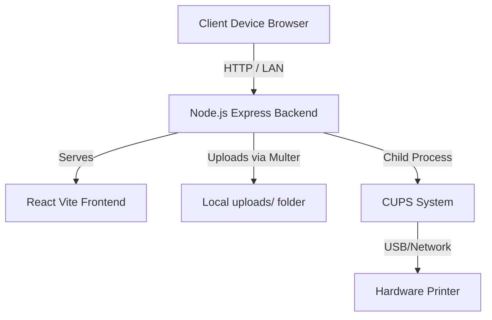

# Local Secure Printing System

## 1. Project Overview
This project is a localized secure printing automation system designed to run entirely on a central machine, such as a Raspberry Pi, connected to a local network. It allows users to upload documents directly from their devices over Wi-Fi, manage multiple printers via an Admin Interface, and print using Linux's CUPS (Common UNIX Printing System). This acts as a private, offline-first print shop replacement, giving full control without relying on any external cloud services.

## 2. Features
- **Local File Upload**: Directly upload files (PDFs, images, etc.) from any device on the network up to 50MB.
- **Admin Print Portal**: A comprehensive, responsive web dashboard built in React to view, select, and manage printers.
- **Offline-First System**: Runs seamlessly on local networks (LAN) without needing an external internet connection.
- **CUPS Integration**: Native bridging to CUPS enabling deep integration with USB or network-based printers on the host machine.
- **Dynamic Device Management**: Set default printers, query printer status, and route jobs accordingly.

## 3. Architecture Diagram



## 4. Tech Stack
- **Frontend**: React (19), TypeScript, Vite, Lucide React (Icons).
- **Backend**: Node.js, Express, TypeScript, Multer, `cors`.
- **Operating System**: Linux (Raspberry Pi OS) utilizing CUPS.

## 5. Installation Guide (Raspberry Pi)
Assuming you are on a Raspberry Pi running a Debian-based OS:

1. **Install Node.js & Git**:
   ```bash
   sudo apt update
   sudo apt install -y build-essential git nodejs npm
   ```
2. **Setup CUPS** *(If not already installed)*:
   ```bash
   sudo apt install -y cups
   sudo usermod -a -G lpadmin pi
   ```
3. **Clone the Repository**:
   ```bash
   git clone https://github.com/shadow-monarch08/Printing_automation.git
   cd Printing_automation
   ```
4. **Run the Deployment Script**:
   ```bash
   chmod +x deploy.sh
   ./deploy.sh
   ```

## 6. Development Setup
To work on the project or run entirely separated dev-servers:

**Frontend**:
```bash
cd admin-ui
npm install
npm run dev
```

**Backend**:
```bash
cd server
npm install
npm run dev
```

The frontend runs locally by default proxying API requests to the origin. Ensure you alter it appropriately for proxy if running locally on split ports (Vite default is usually `:5173`, node backend is `:3000`).

## 7. Usage Guide
1. **Access Admin Panel**: Navigate to `http://<YOUR_PI_LAN_IP>:3000` via any browser on the local network.
2. **Configure Printers**: Any USB or Network printer properly registered via CUPS on the Raspberry Pi will automatically appear. Click "Set Default" to choose the main routing path.
3. **Upload and Print Document**: Use the file upload form to select a document from your client device, select the target printer (or default), and click Print. The node server receives the file and invokes CUPS.

## 8. Folder Structure
```
Printing_automation/
├── admin-ui/          # React + Vite frontend source code
│   ├── src/           # React Components, API fetch routes, css
│   └── (build output) -> dist/
├── server/            # Node.js + Express backend
│   ├── src/           # Controllers, Routes, Express init
│   ├── public/        # Copied output from admin-ui/dist
│   ├── uploads/       # Storage folder for uploaded documents
│   └── (build output) -> dist/
├── deploy.sh          # One-click full-stack deployment script
└── README.md
```

## 9. Future Scope
- **Queue System**: Expose the live CUPS print queue inside the React Admin UI. Show pending, printing, or failed jobs visually.
- **Payments**: Integrate a Stripe/Razorpay hook so public users can pay per-page before releasing the print job on the backend.
- **Public User Portal**: A restricted 'guest' view that only allows uploading a file and a payment flow, heavily isolating them from printer settings.
- **Auto-Cleanup**: A cron job or script to purge the `uploads/` folder securely after successful prints.

## 10. Troubleshooting
- **CUPS Error - Printer NotFound**: Verify CUPS is active using `curl localhost:631` on the Pi. Ensure your printer driver is installed locally.
- **Port Access Issues**: If `:3000` fails, ensure your firewall (UFW or IPTables) is explicitly allowing port 3000 `sudo ufw allow 3000`.
- **LAN Access Issues**: Attempt pinging the Raspberry Pi IP from your device. Make sure the Pi is on the same subnet as the client device, and hasn't changed IP addresses via DHCP reassignments.
