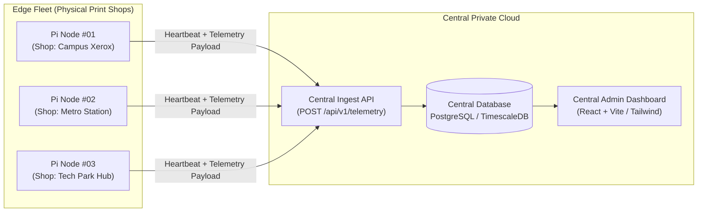
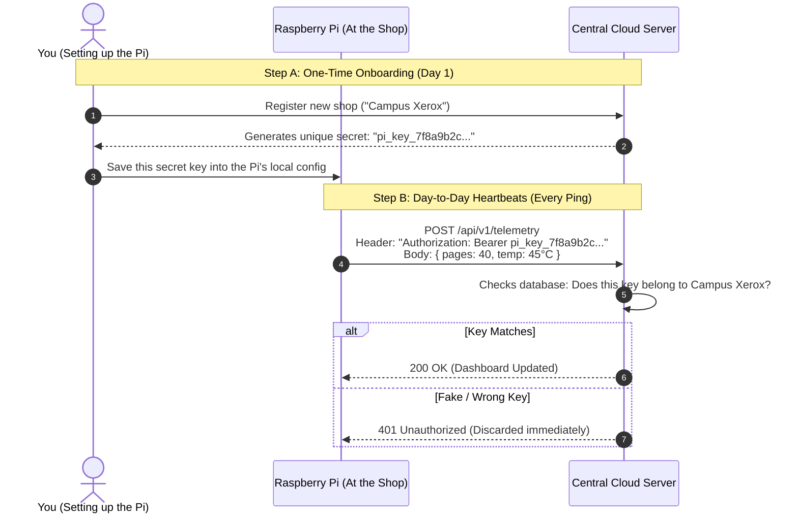

```mermaid
graph LR
    subgraph Edge_Fleet["Edge Fleet (Physical Print Shops)"]
        Pi1["Pi Node #01<br>(Shop: Campus Xerox)"]
        Pi2["Pi Node #02<br>(Shop: Metro Station)"]
        Pi3["Pi Node #03<br>(Shop: Tech Park Hub)"]
    end

    subgraph Central_Cloud["Central Private Cloud"]
        IngestAPI["Central Ingest API<br>(POST /api/v1/telemetry)"]
        CentralDB[(Central Database<br>PostgreSQL / TimescaleDB)]
        CentralUI["Central Admin Dashboard<br>(React + Vite / Tailwind)"]
    end

    Pi1 -->|Heartbeat + Telemetry Payload| IngestAPI
    Pi2 -->|Heartbeat + Telemetry Payload| IngestAPI
    Pi3 -->|Heartbeat + Telemetry Payload| IngestAPI
    IngestAPI --> CentralDB
    CentralDB --> CentralUI
```

---

```mermaid
sequenceDiagram
    autonumber
    actor Admin as You (Setting up the Pi)
    participant Pi as Raspberry Pi (At the Shop)
    participant Cloud as Central Cloud Server

    Note over Admin, Cloud: Step A: One-Time Onboarding (Day 1)
    Admin->>Cloud: Register new shop ("Campus Xerox")
    Cloud-->>Admin: Generates unique secret: "pi_key_7f8a9b2c..."
    Admin->>Pi: Save this secret key into the Pi's local config

    Note over Pi, Cloud: Step B: Day-to-Day Heartbeats (Every Ping)
    Pi->>Cloud: POST /api/v1/telemetry<br>Header: "Authorization: Bearer pi_key_7f8a9b2c..."<br>Body: { pages: 40, temp: 45°C }
    
    Cloud->>Cloud: Checks database: Does this key belong to Campus Xerox?
    alt Key Matches
        Cloud-->>Pi: 200 OK (Dashboard Updated)
    else Fake / Wrong Key
        Cloud-->>Pi: 401 Unauthorized (Discarded immediately)
    end

```