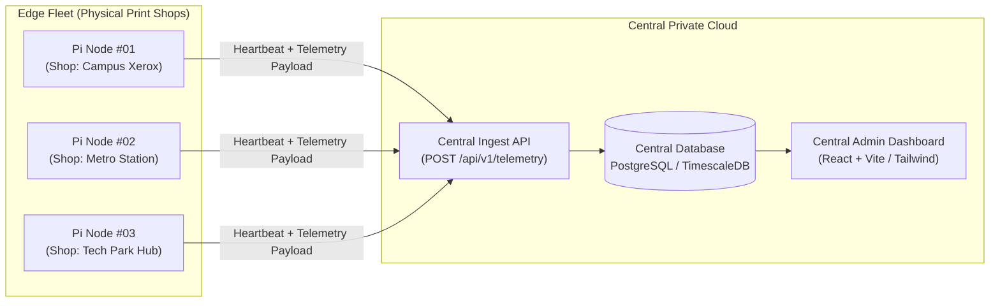
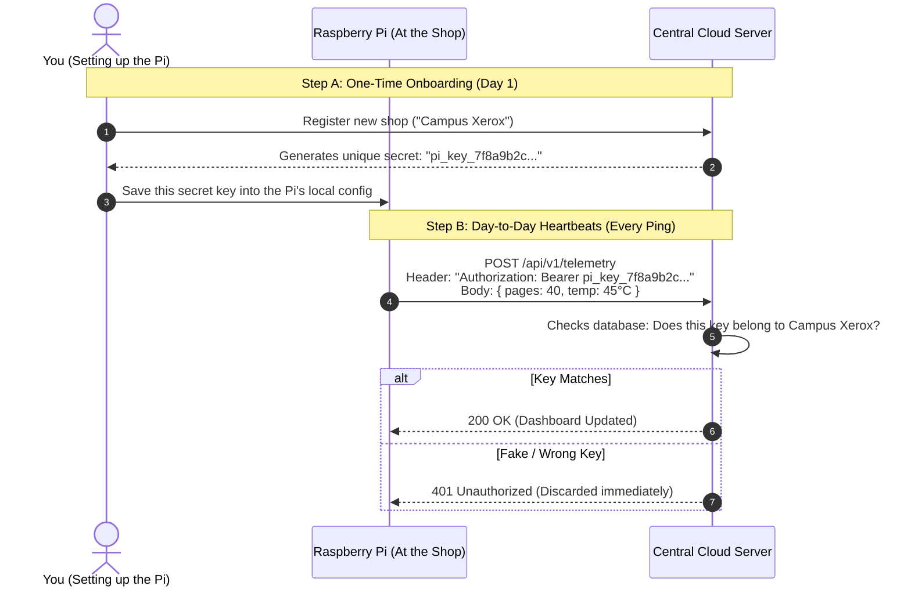
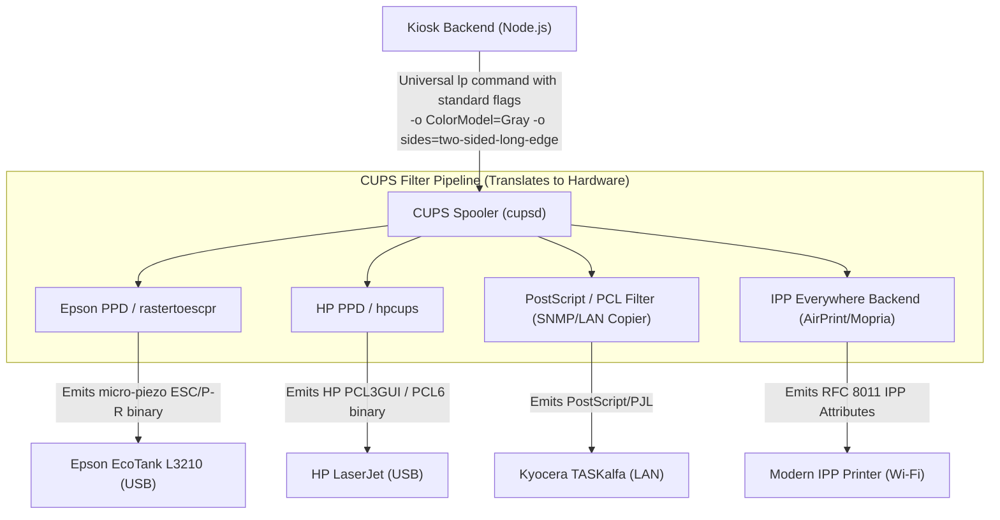
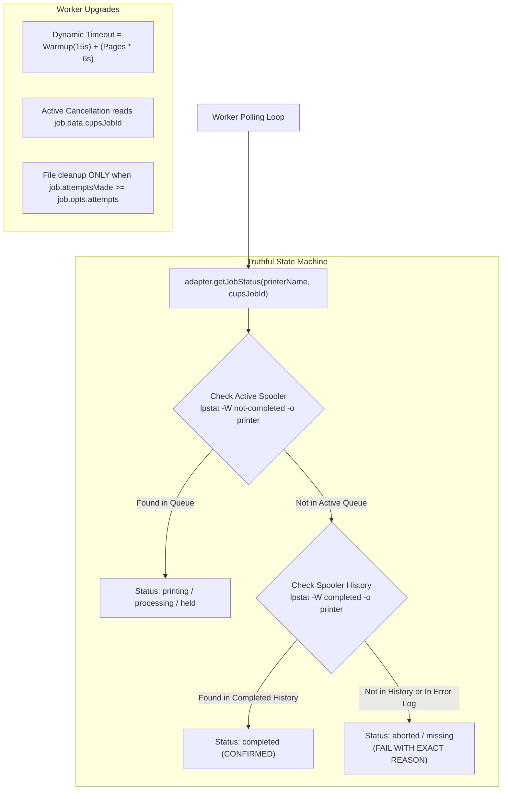

```mermaid
graph LR
    subgraph Edge_Fleet["Edge Fleet (Physical Print Shops)"]
        Pi1["Pi Node #01<br>(Shop: Campus Xerox)"]
        Pi2["Pi Node #02<br>(Shop: Metro Station)"]
        Pi3["Pi Node #03<br>(Shop: Tech Park Hub)"]
    end

    subgraph Central_Cloud["Central Private Cloud"]
        IngestAPI["Central Ingest API<br>(POST /api/v1/telemetry)"]
        CentralDB[(Central Database<br>PostgreSQL / TimescaleDB)]
        CentralUI["Central Admin Dashboard<br>(React + Vite / Tailwind)"]
    end

    Pi1 -->|Heartbeat + Telemetry Payload| IngestAPI
    Pi2 -->|Heartbeat + Telemetry Payload| IngestAPI
    Pi3 -->|Heartbeat + Telemetry Payload| IngestAPI
    IngestAPI --> CentralDB
    CentralDB --> CentralUI
```

---

```mermaid
sequenceDiagram
    autonumber
    actor Admin as You (Setting up the Pi)
    participant Pi as Raspberry Pi (At the Shop)
    participant Cloud as Central Cloud Server

    Note over Admin, Cloud: Step A: One-Time Onboarding (Day 1)
    Admin->>Cloud: Register new shop ("Campus Xerox")
    Cloud-->>Admin: Generates unique secret: "pi_key_7f8a9b2c..."
    Admin->>Pi: Save this secret key into the Pi's local config

    Note over Pi, Cloud: Step B: Day-to-Day Heartbeats (Every Ping)
    Pi->>Cloud: POST /api/v1/telemetry<br>Header: "Authorization: Bearer pi_key_7f8a9b2c..."<br>Body: { pages: 40, temp: 45°C }
    
    Cloud->>Cloud: Checks database: Does this key belong to Campus Xerox?
    alt Key Matches
        Cloud-->>Pi: 200 OK (Dashboard Updated)
    else Fake / Wrong Key
        Cloud-->>Pi: 401 Unauthorized (Discarded immediately)
    end

```

---

```mermaid
graph TD
    A["Kiosk Backend (Node.js)"] -->|"Universal lp command with standard flags\n-o ColorModel=Gray -o sides=two-sided-long-edge"| B["CUPS Spooler (cupsd)"]
    
    subgraph Pipeline ["CUPS Filter Pipeline (Translates to Hardware)"]
        B --> C["Epson PPD / rastertoescpr"]
        B --> D["HP PPD / hpcups"]
        B --> E["PostScript / PCL Filter (SNMP/LAN Copier)"]
        B --> F["IPP Everywhere Backend (AirPrint/Mopria)"]
    end
    
    C -->|"Emits micro-piezo ESC/P-R binary"| G["Epson EcoTank L3210 (USB)"]
    D -->|"Emits HP PCL3GUI / PCL6 binary"| H["HP LaserJet (USB)"]
    E -->|"Emits PostScript/PJL"| I["Kyocera TASKalfa (LAN)"]
    F -->|"Emits RFC 8011 IPP Attributes"| J["Modern IPP Printer (Wi-Fi)"]
```

---

```mermaid
graph TD
    A["Worker Polling Loop"] --> B["adapter.getJobStatus(printerName, cupsJobId)"]
    
    subgraph Truthful State Machine
        B --> C{"Check Active Spooler<br/>lpstat -W not-completed -o printer"}
        C -->|"Found in Queue"| D["Status: printing / processing / held"]
        
        C -->|"Not in Active Queue"| E{"Check Spooler History<br/>lpstat -W completed -o printer"}
        E -->|"Found in Completed History"| F["Status: completed (CONFIRMED)"]
        E -->|"Not in History or In Error Log"| G["Status: aborted / missing<br/>(FAIL WITH EXACT REASON)"]
    end
    
    subgraph Worker Upgrades
        H["Dynamic Timeout = Warmup(15s) + (Pages * 6s)"]
        I["Active Cancellation reads job.data.cupsJobId"]
        J["File cleanup ONLY when job.attemptsMade >= job.opts.attempts"]
    end

```