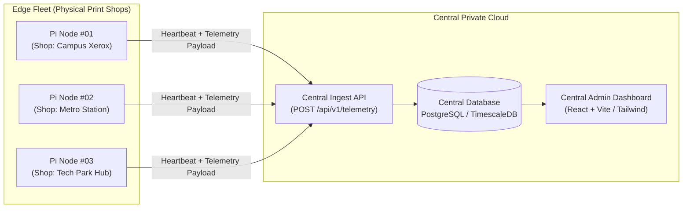
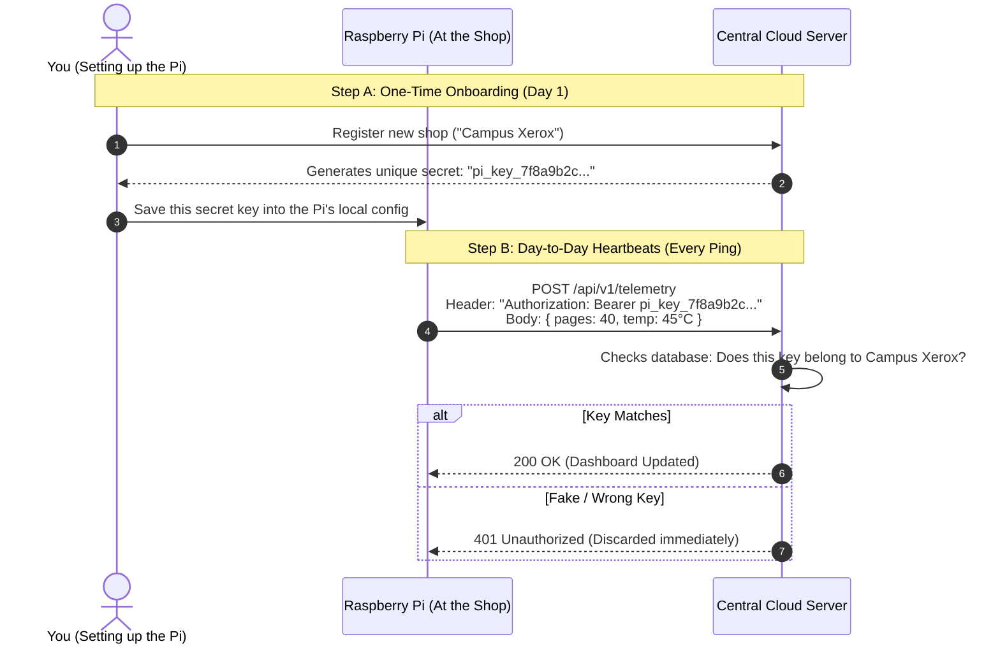
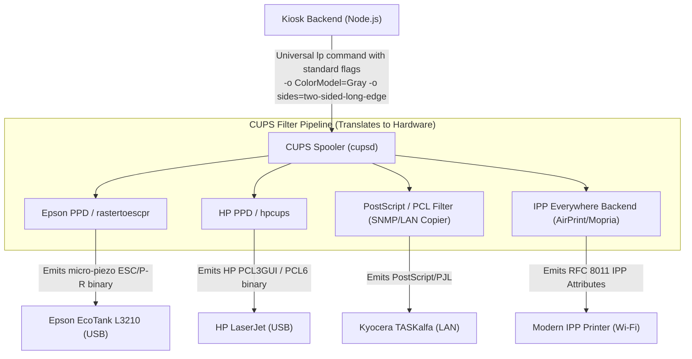
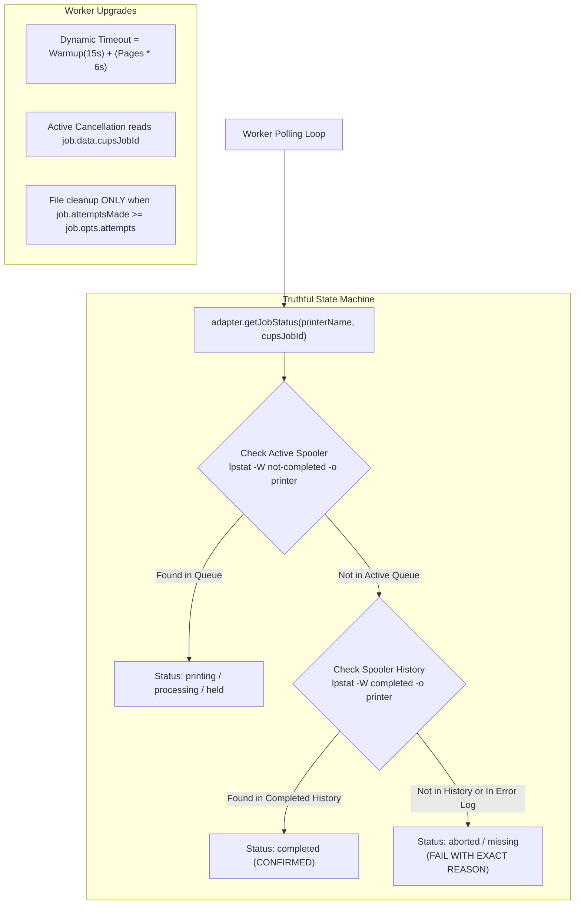
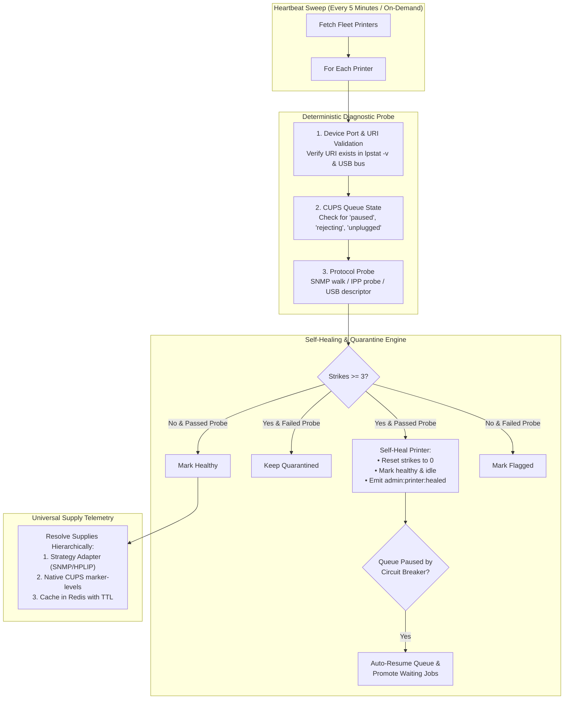
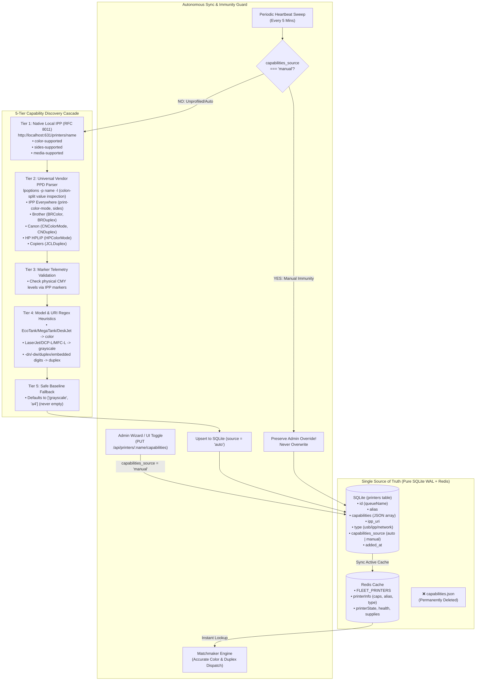
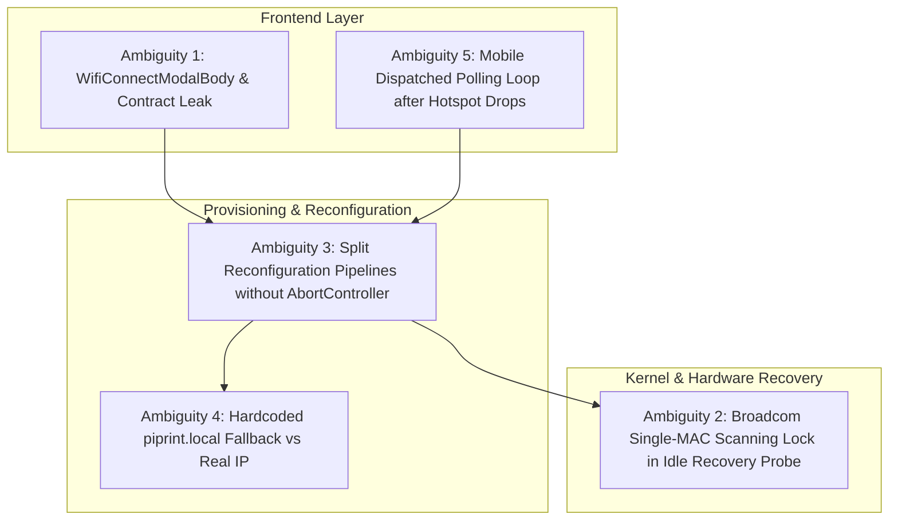

```mermaid
graph LR
    subgraph Edge_Fleet["Edge Fleet (Physical Print Shops)"]
        Pi1["Pi Node #01<br>(Shop: Campus Xerox)"]
        Pi2["Pi Node #02<br>(Shop: Metro Station)"]
        Pi3["Pi Node #03<br>(Shop: Tech Park Hub)"]
    end

    subgraph Central_Cloud["Central Private Cloud"]
        IngestAPI["Central Ingest API<br>(POST /api/v1/telemetry)"]
        CentralDB[(Central Database<br>PostgreSQL / TimescaleDB)]
        CentralUI["Central Admin Dashboard<br>(React + Vite / Tailwind)"]
    end

    Pi1 -->|Heartbeat + Telemetry Payload| IngestAPI
    Pi2 -->|Heartbeat + Telemetry Payload| IngestAPI
    Pi3 -->|Heartbeat + Telemetry Payload| IngestAPI
    IngestAPI --> CentralDB
    CentralDB --> CentralUI
```

---

```mermaid
sequenceDiagram
    autonumber
    actor Admin as You (Setting up the Pi)
    participant Pi as Raspberry Pi (At the Shop)
    participant Cloud as Central Cloud Server

    Note over Admin, Cloud: Step A: One-Time Onboarding (Day 1)
    Admin->>Cloud: Register new shop ("Campus Xerox")
    Cloud-->>Admin: Generates unique secret: "pi_key_7f8a9b2c..."
    Admin->>Pi: Save this secret key into the Pi's local config

    Note over Pi, Cloud: Step B: Day-to-Day Heartbeats (Every Ping)
    Pi->>Cloud: POST /api/v1/telemetry<br>Header: "Authorization: Bearer pi_key_7f8a9b2c..."<br>Body: { pages: 40, temp: 45°C }
    
    Cloud->>Cloud: Checks database: Does this key belong to Campus Xerox?
    alt Key Matches
        Cloud-->>Pi: 200 OK (Dashboard Updated)
    else Fake / Wrong Key
        Cloud-->>Pi: 401 Unauthorized (Discarded immediately)
    end

```

---

```mermaid
graph TD
    A["Kiosk Backend (Node.js)"] -->|"Universal lp command with standard flags\n-o ColorModel=Gray -o sides=two-sided-long-edge"| B["CUPS Spooler (cupsd)"]
    
    subgraph Pipeline ["CUPS Filter Pipeline (Translates to Hardware)"]
        B --> C["Epson PPD / rastertoescpr"]
        B --> D["HP PPD / hpcups"]
        B --> E["PostScript / PCL Filter (SNMP/LAN Copier)"]
        B --> F["IPP Everywhere Backend (AirPrint/Mopria)"]
    end
    
    C -->|"Emits micro-piezo ESC/P-R binary"| G["Epson EcoTank L3210 (USB)"]
    D -->|"Emits HP PCL3GUI / PCL6 binary"| H["HP LaserJet (USB)"]
    E -->|"Emits PostScript/PJL"| I["Kyocera TASKalfa (LAN)"]
    F -->|"Emits RFC 8011 IPP Attributes"| J["Modern IPP Printer (Wi-Fi)"]
```

---

```mermaid
graph TD
    A["Worker Polling Loop"] --> B["adapter.getJobStatus(printerName, cupsJobId)"]
    
    subgraph Truthful State Machine
        B --> C{"Check Active Spooler<br/>lpstat -W not-completed -o printer"}
        C -->|"Found in Queue"| D["Status: printing / processing / held"]
        
        C -->|"Not in Active Queue"| E{"Check Spooler History<br/>lpstat -W completed -o printer"}
        E -->|"Found in Completed History"| F["Status: completed (CONFIRMED)"]
        E -->|"Not in History or In Error Log"| G["Status: aborted / missing<br/>(FAIL WITH EXACT REASON)"]
    end
    
    subgraph Worker Upgrades
        H["Dynamic Timeout = Warmup(15s) + (Pages * 6s)"]
        I["Active Cancellation reads job.data.cupsJobId"]
        J["File cleanup ONLY when job.attemptsMade >= job.opts.attempts"]
    end

```

---

```mermaid
flowchart TD
    subgraph PeriodicSweep ["Heartbeat Sweep (Every 5 Minutes / On-Demand)"]
        SWEEP[Fetch Fleet Printers] --> LOOP[For Each Printer]
    end

    subgraph HealthProbe ["Deterministic Diagnostic Probe"]
        LOOP --> URI_CHECK["1. Device Port & URI Validation\nVerify URI exists in lpstat -v & USB bus"]
        URI_CHECK --> CUPS_CHECK["2. CUPS Queue State\nCheck for 'paused', 'rejecting', 'unplugged'"]
        CUPS_CHECK --> ADAPTER_CHECK["3. Protocol Probe\nSNMP walk / IPP probe / USB descriptor"]
    end

    subgraph Healing ["Self-Healing & Quarantine Engine"]
        ADAPTER_CHECK --> IS_QUARANTINED{Strikes >= 3?}
        IS_QUARANTINED -->|Yes & Passed Probe| HEAL["Self-Heal Printer:\n• Reset strikes to 0\n• Mark healthy & idle\n• Emit admin:printer:healed"]
        IS_QUARANTINED -->|Yes & Failed Probe| KEEP_Q[Keep Quarantined]
        IS_QUARANTINED -->|No & Passed Probe| MARK_H[Mark Healthy]
        IS_QUARANTINED -->|No & Failed Probe| INCR[Mark Flagged]
        
        HEAL --> RESUME_CHECK{"Queue Paused by\nCircuit Breaker?"}
        RESUME_CHECK -->|Yes| RESUME_QUEUE["Auto-Resume Queue &\nPromote Waiting Jobs"]
    end

    subgraph Telemetry ["Universal Supply Telemetry"]
        MARK_H --> SUPPLIES["Resolve Supplies Hierarchically:\n1. Strategy Adapter (SNMP/HPLIP)\n2. Native CUPS marker-levels\n3. Cache in Redis with TTL"]
    end

```

---

```mermaid
flowchart TD
    subgraph Storage ["Single Source of Truth (Pure SQLite WAL + Redis)"]
        SQLITE[("SQLite (printers table)\n• id (queueName)\n• alias\n• capabilities (JSON array)\n• ipp_uri\n• type (usb/ipp/network)\n• capabilities_source (auto | manual)\n• added_at")]
        REDIS[("Redis Cache\n• FLEET_PRINTERS\n• printerInfo (caps, alias, type)\n• printerState, health, supplies")]
        DEPRECATED["❌ capabilities.json\n(Permanently Deleted)"]
    end

    subgraph Probing ["5-Tier Capability Discovery Cascade"]
        T1["Tier 1: Native Local IPP (RFC 8011)\nhttp://localhost:631/printers/name\n• color-supported\n• sides-supported\n• media-supported"]
        T2["Tier 2: Universal Vendor PPD Parser\nlpoptions -p name -l (colon-split value inspection)\n• IPP Everywhere (print-color-mode, sides)\n• Brother (BRColor, BRDuplex)\n• Canon (CNColorMode, CNDuplex)\n• HP HPLIP (HPColorMode)\n• Copiers (JCLDuplex)"]
        T3["Tier 3: Marker Telemetry Validation\n• Check physical CMY levels via IPP markers"]
        T4["Tier 4: Model & URI Regex Heuristics\n• EcoTank/MegaTank/DeskJet -> color\n• LaserJet/DCP-L/MFC-L -> grayscale\n• -dn/-dw/duplex/embedded digits -> duplex"]
        T5["Tier 5: Safe Baseline Fallback\n• Defaults to ['grayscale', 'a4'] (never empty)"]
    end

    subgraph Sync ["Autonomous Sync & Immunity Guard"]
        HEARTBEAT["Periodic Heartbeat Sweep\n(Every 5 Mins)"]
        ADMIN["Admin Wizard / UI Toggle\n(PUT /api/printers/:name/capabilities)"]

        ADMIN -->|capabilities_source = 'manual'| SQLITE
        HEARTBEAT --> CHECK{"capabilities_source\n=== 'manual'?"}
        CHECK -->|YES: Manual Immunity| PRESERVE["Preserve Admin Override!\nNever Overwrite"]
        CHECK -->|NO: Unprofiled/Auto| T1
        T1 --> T2 --> T3 --> T4 --> T5 --> UPSERT["Upsert to SQLite (source = 'auto')"]
        UPSERT --> SQLITE
        PRESERVE --> SQLITE
        SQLITE -->|Sync Active Cache| REDIS
        REDIS -->|Instant Lookup| MATCHMAKER["Matchmaker Engine\n(Accurate Color & Duplex Dispatch)"]
    end
```

---

```mermaid
flowchart TD
    subgraph UI_Layer [Frontend Layer]
        A[Ambiguity 1: WifiConnectModalBody & Contract Leak]
        E[Ambiguity 5: Mobile Dispatched Polling Loop after Hotspot Drops]
    end

    subgraph Backend_Pipeline [Provisioning & Reconfiguration]
        C[Ambiguity 3: Split Reconfiguration Pipelines without AbortController]
        D[Ambiguity 4: Hardcoded piprint.local Fallback vs Real IP]
    end

    subgraph Hardware_Daemon [Kernel & Hardware Recovery]
        B[Ambiguity 2: Broadcom Single-MAC Scanning Lock in Idle Recovery Probe]
    end

    A --> C
    E --> C
    C --> B
    C --> D

```