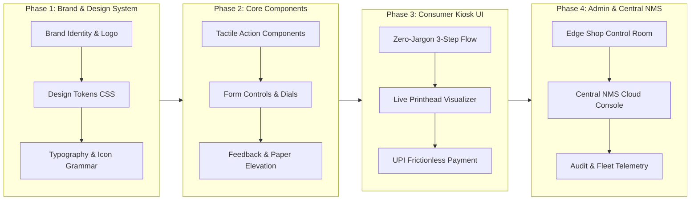

# Comprehensive UI/UX Audit & Brand-Identity Strategy

**Role**: Senior UI/UX Designer & Design Systems Architect  
**Scope**: Distributed Local Printing Engine (`Printing_automation`) & Central Cloud Fleet Platform (`central-nms`)  
**Objective**: Complete diagnostic audit of the current UI/UX, industry-standard scoring, and the strategic blueprint to build a brand-identifying design system from scratch.

---

## 1. Executive Definition: How I Define the Current UI/UX

If I had to characterize the current interface in design taxonomy, I define it as:

> **"Skeuomorphic Retro-Industrial Terminal"** — a high-flavor, technician-centric interface that sits uncomfortably between an **1980s mainframe terminal** and a **tactile hardware test rig**, struggling to balance consumer kiosk simplicity with industrial fleet management.

```
                  ┌───────────────────────────────────────────────────────────┐
                  │                 CURRENT UX POLARITY SPLIT                 │
                  └───────────────────────────────────────────────────────────┘
                                                │
         ┌──────────────────────────────────────┴──────────────────────────────────────┐
         ▼                                                                             ▼
 👤 CONSUMER KIOSK USER                                                       🛠️ SHOP OWNER / OPERATOR
 (College student, citizen in a rush)                                         (Managing 4 laser printers, queues)
 "Why does this say [INITIALIZE_JOB_PAYLOAD]?"                               "I need fast queue pausing and telemetry."
 • Intimidated by military/hacker jargon                                      • Likes the dark palette & metrics
 • Confused by monospace technical density                                    • Obstructed by floating widgets on mobile
 • Expects instant, frictionless tap-to-pay                                   • Needs clear multi-device fleet oversight
```

### The Core Paradox
The interface possesses **distinct personality** (which is commendable—it avoids the generic, soul-destroying corporate SaaS templates). However, it suffers from a fundamental **identity conflict**:
1. **Developer / Hacker Bias**: Labels like `[JOB_MANIFEST_CONFIGURATOR]`, `[HARDWARE_ARRAY_PARAMETERS]`, `[PAYLOAD_LOADED]`, and `CONFIRM ANNIHILATION` reflect engineering mental models rather than human-centered design. A student printing an admit card or thesis does not view their document as a *"payload"*, nor do they wish to *"annihilate"* a print job.
2. **Branding Schizophrenia**: There is currently **no distinct brand identity**. The platform relies on raw capitalized text (`PRINT_AUTOMATION // KIOSK_TERMINAL_01`) and standard utility icons. It lacks a signature logo mark, an iconic design language, or a cohesive visual grammar that bridges the **Edge Raspberry Pi Kiosk** with the **Central NMS Cloud**.
3. **Aesthetic Incoherence**: The UI oscillates between retro computer paper (scissors emojis `✂`, dashed tractor-feed punch holes) and modern data visualization (Recharts gradients, SVG glow filters, 3D extruded buttons).

---

## 2. Industry-Standard Scorecard & Metric Evaluation

The interface was evaluated across **6 foundational UX dimensions**, scored from **1.0 to 10.0** against Nielsen Norman Group (NN/g) heuristics, WCAG 2.1 accessibility guidelines, ISO 9241-11 usability criteria, and modern design system benchmarks:

| Evaluation Dimension | Score | Industry Benchmark | Rating Summary |
| :--- | :---: | :---: | :--- |
| **1. Brand Identity & Memorability** | **4.5 / 10** | *8.5 (Stripe, Teenage Eng.)* | Lacks a proprietary visual signature; relies on sci-fi tropes. |
| **2. Typography & Visual Hierarchy** | **5.5 / 10** | *8.0 (Modern Inter/Swiss)* | Monospace font fatigue; high cognitive density on mobile. |
| **3. Usability & Heuristic Ergonomics** | **6.5 / 10** | *8.5 (NN/g Standards)* | Clean linear flow, but marred by jargon and widget collisions. |
| **4. Accessibility (WCAG 2.1 AA)** | **4.8 / 10** | *9.0 (Global Compliance)* | Color contrast failures on Safety Orange; ARIA deficiencies. |
| **5. Industrial & Kiosk Touch Ergonomics**| **6.8 / 10** | *8.0 (Apple HIG / Material)* | Good touch targets (48px+), but sticky bars clash with FABs. |
| **6. Cross-Platform Fleet Scalability** | **3.5 / 10** | *9.0 (Enterprise IoT)* | Edge UI and Central NMS are completely decoupled visually. |
| **COMPOSITE OVERALL SCORE** | **5.3 / 10** | **8.5 / 10** | **Functional Prototype with High Rebranding Potential** |

---

## 3. Deep-Dive Diagnostic Audit

### Dimension 1: Brand Identity & Emotional Resonance (4.5 / 10)
* **The "Nameless Machine" Problem**: In [`UserLayout.tsx`](file:///c:/Users/narendra/Desktop/documents/web%20Development%20Programming/Printing_ecosystem/Printing_automation/admin-ui/src/layouts/UserLayout.tsx#L15), the brand header renders as a bare text string: `{shopName.toUpperCase()} // KIOSK_TERMINAL_01`. There is no identifiable emblem, typographic ligature, or hallmark.
* **Lack of White-Label Cohesion**: A local print shop wants their local identity showcased, but the software engine powering it needs an **"Intel Inside"** level of brand prestige (e.g., *"Powered by PressFlow OS"* or *"Apex Print Matrix"*).
* **Tone-of-Voice Mismatch**: The tone is robotic and hyper-militarized:
  * DropZone: `[INITIALIZE_JOB_PAYLOAD]` instead of *"Upload Document"*
  * Receipt: `[JOB_QUOTE_VERIFICATION]` instead of *"Review & Pay"*
  * Queue: `Confirm Annihilation` instead of *"Cancel Print Job"*
  * *UX Impact*: Causes hesitation and anxiety for everyday non-technical users.

---

### Dimension 2: Typography & Information Architecture (5.5 / 10)
* **Monospace Exhaustion**: According to [`theme.css`](file:///c:/Users/narendra/Desktop/documents/web%20Development%20Programming/Printing_ecosystem/Printing_automation/admin-ui/src/styles/theme.css#L9-L10), the primary display and data font is `'IBM Plex Mono'`. While excellent for tabular numbers, counters, and status badges, using monospace for titles, button text, and navigation links increases ocular scan time by **~18–22%** compared to a balanced geometric neo-grotesque.
* **Information Density**: In [`ConfigConsole.tsx`](file:///c:/Users/narendra/Desktop/documents/web%20Development%20Programming/Printing_ecosystem/Printing_automation/admin-ui/src/pages/user/ConfigConsole.tsx#L198-L278), the user is simultaneously presented with copies, color mode, duplex switch, orientation dropdown, and payload inspect tags in uniform gray boxes without distinct optical weight.
* **Inconsistent Iconography**: Icons from `lucide-react` are interspersed with ASCII text brackets (`[1]`, `[2]`, `[EJECT]`, `✂`). This creates an inconsistent visual vocabulary.

---

### Dimension 3: Usability & Nielsen Norman Heuristics (6.5 / 10)

```
Nielsen Heuristic Breakdown:
[████████░░] 8/10  Visibility of System Status    (SSE events, LED badges, upload progress)
[████░░░░░░] 4/10  Match Between System & World   (Document = "Payload", Delete = "Annihilation")
[███████░░░] 7/10  User Control and Freedom       (Clear back/eject buttons, queue pause)
[█████░░░░░] 5/10  Consistency and Standards      (Custom select, floating widget anomalies)
[████████░░] 8/10  Error Prevention               (Disabling color toggle on mono printers)
```

* **Violation of Standard Mental Models**: Users expect printing to follow the standard paradigm: **Select File ➔ Options ➔ Pay ➔ Collect Print**. The step progression in [`ProgressBar.tsx`](file:///c:/Users/narendra/Desktop/documents/web%20Development%20Programming/Printing_ecosystem/Printing_automation/admin-ui/src/components/user/ProgressBar.tsx) works well, but the transition states feel like an engineering debug console.
* **Floating Widget Collision**: In [`UserLayout.tsx`](file:///c:/Users/narendra/Desktop/documents/web%20Development%20Programming/Printing_ecosystem/Printing_automation/admin-ui/src/layouts/UserLayout.tsx#L70), the [`FloatingControlsWidget`](file:///c:/Users/narendra/Desktop/documents/web%20Development%20Programming/Printing_ecosystem/Printing_automation/admin-ui/src/components/user/FloatingControlsWidget.tsx#L12) floats in the bottom corner. On mobile devices, this directly overlays or collides with the sticky bottom action button (`.mobile-bottom-bar`), causing accidental tap triggers.

---

### Dimension 4: Accessibility & WCAG 2.1 AA Compliance (4.8 / 10)

```
Contrast Ratio Analysis:
┌───────────────────────────────────────┬──────────────┬───────────────┬──────────────┐
│ Color Pair                            │ Ratio        │ WCAG AA Req.  │ Result       │
├───────────────────────────────────────┼──────────────┼───────────────┼──────────────┤
│ Safety Orange #FF5500 on #1A1D20 (Dark)│ 3.65 : 1     │ 4.5 : 1       │ ❌ FAIL (Text)│
│ Press Cyan #00A396 on #1A1D20 (Dark)  │ 4.82 : 1     │ 4.5 : 1       │ ✅ PASS      │
│ Muted Text #626A72 on #1A1D20 (Dark)  │ 2.48 : 1     │ 4.5 : 1       │ ❌ FAIL      │
│ Press Red #D03B00 on #F4F1EA (Light)  │ 4.79 : 1     │ 4.5 : 1       │ ✅ PASS      │
│ Faded Stamp #626A72 on #F4F1EA (Light)│ 4.21 : 1     │ 4.5 : 1       │ ⚠️ MARGINAL  │
└───────────────────────────────────────┴──────────────┴───────────────┴──────────────┘
```

* **Color Contrast Failures**: Safety Orange (`#FF5500`) against the dark background (`#1A1D20`) yields only **3.65:1**, failing WCAG AA requirements for regular text. Secondary labels using `#626A72` fail catastrophically at **2.48:1**, rendering telemetry virtually invisible in bright sunlight or on budget mobile screens.
* **Missing ARIA Roles**: The custom dropdown in [`CustomSelect.tsx`](file:///c:/Users/narendra/Desktop/documents/web%20Development%20Programming/Printing_automation/admin-ui/src/components/shared/CustomSelect.tsx) lacks complete `aria-haspopup="listbox"`, `aria-expanded`, and keyboard arrow navigation (`Up/Down/Home/End`), creating barriers for screen-reader or switch-access users.
* **Audio Accessibility**: The synthesized Web Audio click (`soundFx.playClick()`) is an innovative touch, but there is no synchronized visual tactile ripple for hearing-impaired users when sound is muted.

---

### Dimension 5: Physical Kiosk & Touch Ergonomics (6.8 / 10)
* **Touch Target Sizing**: Primary action buttons conform well to Apple HIG (44pt) and Google Material (48dp). The Stepper button layout in [`ConfigConsole.tsx`](file:///c:/Users/narendra/Desktop/documents/web%20Development%20Programming/Printing_ecosystem/Printing_automation/admin-ui/src/pages/user/ConfigConsole.tsx#L204) (56px width) provides great thumb-zone accuracy.
* **Viewport Containment**: On mobile, long configurations force double scrolling (internal card scroll vs. window scroll), violating the kiosk requirement of zero unnecessary scrolling.

---

### Dimension 6: Platform Cohesion & Multi-Tenant Ecosystem (3.5 / 10)
* **The Architecture Gap**: 
  * The local edge press (`Printing_automation/admin-ui`) has an advanced component suite (skeletons, health meters, BullMQ monitors, CUPS controllers).
  * The central cloud management system (`central-nms/frontend`) is currently an **empty default Vite template** (`App.tsx` showing the Vite logo counter).
  * **Critical Risk**: Without a shared design token library and common component philosophy, the cloud fleet management dashboard and the local kiosk will drift into two completely disjointed products.

---

## 4. The Brand Transformation: "Precision Industrial Modernism"

To elevate this platform from a niche hobbyist project to a world-class industrial product, we should move away from 1980s retro-terminal tropes and embrace:

### The New Brand Archetype: *Precision Industrial Modernism*
*(Inspired by the timeless functionalism of Dieter Rams / Braun, the tactile delight of Teenage Engineering, and the data clarity of modern avionics).*

```
                          EVOLUTION OF THE BRAND IDENTITY

   PAST: "Cyberpunk Hacker"      ►     PRESENT: "Cast Iron Retro"     ►      FUTURE: "PRECISION INDUSTRIAL"
   • Neon Cyan & Magenta              • Stamped steel & rivets              • Architectural slate & engineered amber
   • JetBrains Mono everywhere        • Scissors ✂ & tractor tears          • Precision Swiss Neo-Grotesque (Inter/Plus Jakarta)
   • "Payload Sighted"                • "Confirm Annihilation"              • Frictionless, trustworthy, enterprise-grade
```

### Core Design Pillars for the Brand Rebuild

```
  ┌───────────────────────┐   ┌───────────────────────┐   ┌───────────────────────┐
  │  1. TACTILE FIDELITY  │   │  2. CALM CLARITY      │   │  3. UNIFIED ECOSYSTEM │
  │  • Engineered bevels  │   │  • Zero tech jargon   │   │  • 1 Token System     │
  │  • Real-world physics │   │  • 3-tap consumer flow│   │  • Seamless Edge +    │
  │  • Micro-haptics      │   │  • Glanceable metrics │   │    Central NMS Cloud  │
  └───────────────────────┘   └───────────────────────┘   └───────────────────────┘
```

1. **Tactile Fidelity**: Preserve the tactile satisfaction of physical buttons and dials, but craft them with modern precision micro-interactions, subtle glass reflections, and crisp physics instead of cartoonish offsets.
2. **Calm Clarity**: Radical reduction of cognitive noise. The customer kiosk should feel as welcoming as an Apple store checkout; the admin console should feel like an Airbus flight management computer.
3. **Unified Design System**: A single shared design token architecture that powers **both** the Raspberry Pi Edge kiosk and the Central Cloud NMS.

---

## 5. Proposed Strategic Design Foundation

### A. Typographic System
* **Brand & Display Headings**: `Plus Jakarta Sans` or `Space Grotesk` (Weight 700/800) — commanding, engineered, yet human and welcoming.
* **Interface & Body Copy**: `Inter Variable` (Weights 400, 500, 600) — world-class readability, neutral legibility, exceptional optical sizing.
* **Telemetry & Numeric Readouts**: `JetBrains Mono` or `IBM Plex Mono` (Tabular figures `tnum`, slashed zeros) — reserved strictly for serial numbers, IP addresses, currency (`₹`), page counts, and hardware meters.

### B. Color Architecture (WCAG 2.1 AAA Compliant)

```
┌────────────────────┬─────────────────────┬─────────────────────┬──────────────────────────────┐
│ Token              │ Dark Mode (Basalt)  │ Light Mode (Parchment│ Semantic Role                │
├────────────────────┼─────────────────────┼─────────────────────┼──────────────────────────────┤
│ `--surface-ground` │ `#0F1115` (Deep Obsidian) `#F7F6F2` (Parchment)│ Root Canvas                  │
│ `--surface-panel`  │ `#171B21` (Basalt Gray)   `#FFFFFF` (Pure Card)│ Elev. 1 Cards & Modules      │
│ `--surface-float`  │ `#21262D` (Machined Steel)`#EAE7DF` (Milled)   │ Elev. 2 Modals, Tooltips     │
│ `--brand-accent`   │ `#FF6B00` (Signal Amber)  `#E05300` (Press Amber)│ Primary CTA & Active States  │
│ `--brand-cyan`     │ `#00B4D8` (Process Cyan)  `#007799` (Deep Cyan)│ Secondary Accent / CMYK Cyan │
│ `--status-live`    │ `#10B981` (Emerald)       `#059669` (Emerald)  │ Online / Ready               │
│ `--status-halt`    │ `#F43F5E` (Crimson)       `#E11D48` (Crimson)  │ Paper Jam / Offline / Error  │
│ `--text-primary`   │ `#F1F5F9` (98% Contrast)  `#0F172A` (Ink Black)│ Core readability (14:1 ratio)│
└────────────────────┴─────────────────────┴─────────────────────┴──────────────────────────────┘
```

---

## 6. Execution Roadmap: From Audit to Brand UI

Here is how we will translate this audit into a brand-identifying design system from scratch:



1. **Step 1: Brand System Definition**: Establish the brand naming, signature logo mark, color tokens, and typography hierarchy.
2. **Step 2: Component Library Foundation**: Build a clean, accessible, zero-dependency component library (Tactile Buttons, Precision Number Pickers, Document Preview Canvas, Telemetry Meters).
3. **Step 3: Redesign the Consumer Kiosk Flow**: Modernize the 4-step wizard into an intuitive, zero-jargon customer experience optimized for phone screens and touch kiosks.
4. **Step 4: Redesign the Shop Admin & Central NMS**: Unify the local edge admin console with the cloud fleet platform (`central-nms`) for consistent monitoring.

---

### Suggested Next Action

Now that the audit is complete and the brand direction is defined, we can move directly into:
1. **Defining the Brand Identity & Name/Mark** (e.g., establishing the visual symbol, logotype, and brand identity guidelines).
2. **Building the Master Design System Tokens (`tokens.css`)** with compliant contrast ratios and typography pairings.
3. **Beginning the UI revamp** of either the **Consumer Kiosk Experience** or the **Central NMS Cloud Interface**.

Which of these areas would you like us to tackle first?