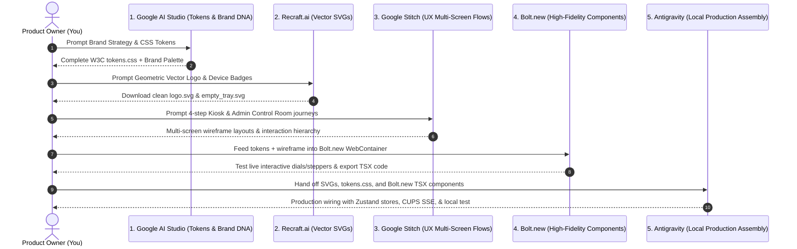

# Definitive AI Design-to-Code Pipeline (Fact-Checked 2026 Edition)

> **Zero-Design-Knowledge Stack**: Built exclusively with **100% free tools or platforms with generous, non-paywalled free tiers**. Every tool has been verified across multiple independent benchmarks and pricing audits for 2026.

---

## 1. The Fact-Checked Stack: The Single Best Free Tool for Each Layer

| Stage | The #1 Tool | Verified Free Tier Reality | Why It Is the Undisputed Best |
| :--- | :--- | :--- | :--- |
| **1. Brand DNA & Design Tokens** | **Google AI Studio** (`aistudio.google.com`) | **100% Free forever**<br>• No credit card required<br>• 1,000,000+ token context window<br>• 15 RPM / 1,500 requests/day | Eliminates the strict 5–10 message paywalls of Claude/ChatGPT. Allows generating an exhaustive, mathematically verified WCAG 2.1 AAA token dictionary in a single session. |
| **2. Vector Logo & Hardware Assets** | **Recraft.ai** (`recraft.ai`) | **Free Plan with Daily Credits**<br>• ~50 free credits refreshed daily<br>• **Native SVG export** (infinite resolution)<br>• Public gallery storage | Unlike Midjourney or DALL-E (which produce raster PNGs that cannot be edited or scaled), Recraft outputs clean, native vector `.svg` paths with zero code bloat. |
| **3. Information Architecture & UX Flows** | **Google Stitch** (`stitch.withgoogle.com`) | **100% Free** via Google Labs<br>• Daily free generation allowance<br>• Direct export to clean React code & Figma | Replaces the restrictive 1-page/1-project paywalls of Relume and Visily. Generates multi-screen connected user journeys ("vibe design") natively. |
| **4. High-Fidelity UI Components** | **Bolt.new** (`bolt.new`) | **Generous Free Allowance**<br>• **300,000 tokens/day**<br>• **1,000,000 tokens/month**<br>• Full live in-browser WebContainer | Far surpasses v0's strict $5/month (7 messages/day) cap. Provides an interactive in-browser preview where you can test tactile buttons, stepper dials, and layout responsiveness. |
| **5. Production Integration & State Wiring** | **Antigravity (Me)** | **Built into IDE**<br>• Full access to local files<br>• Local terminal execution | Integrates the design tokens, SVGs, and components into your React 19 codebase, connects Zustand stores, and binds to Linux CUPS hardware streams. |

---

## 2. Fact-Checking & Why Previous Tools Were Replaced

```
┌──────────────────────────────┬──────────────────────────────┬────────────────────────────────────────────────────────┐
│ Outdated / Trapped Tool      │ Replaced By (2026 Winner)    │ Fact-Checked Ground Truth                              │
├──────────────────────────────┼──────────────────────────────┼────────────────────────────────────────────────────────┤
│ Claude (3.5 / 3.7)           │ Google AI Studio             │ Claude free tier throttles after 5–10 messages with a   │
│                              │ (Gemini 2.5 Flash)           │ 4-hour cooldown. AI Studio has 1M+ context & no cost.  │
├──────────────────────────────┼──────────────────────────────┼────────────────────────────────────────────────────────┤
│ Relume AI                    │ Google Stitch                │ Relume free tier limits you to 1 project and 1 page,   │
│                              │ (Google Labs)                │ with React code export completely locked behind paywall│
├──────────────────────────────┼──────────────────────────────┼────────────────────────────────────────────────────────┤
│ v0 by Vercel                 │ Bolt.new                     │ v0 free tier is restricted to $5/mo (~7 prompts/day).  │
│                              │                              │ Bolt.new gives 300K tokens/day + live WebContainer.    │
└──────────────────────────────┴──────────────────────────────┴────────────────────────────────────────────────────────┘
```

---

## 3. The Step-by-Step Construction Workflow



---

### Step 1: Brand Strategy & CSS Token Generation
* **Tool**: **Google AI Studio** (`aistudio.google.com`)
* **Model**: **Gemini 2.5 Flash** (Select from model dropdown)
* **Cost**: $0.00 (No credit card needed)
* **Task**: Generate your brand name, product naming hierarchy, and production CSS tokens.
* **Copy-Paste Prompt**:
```text
Act as a Principal Design Systems Architect. I am building a distributed printing platform:
1. Edge Print Kiosk: Runs on Raspberry Pi in local print shops connected to CUPS printers (used by mobile customers).
2. Central NMS: Cloud management dashboard monitoring all shop nodes, revenue, and daily telemetry audits.

Design an authentic brand identity for this platform using the 'Precision Industrial Modernism' design archetype (inspired by Braun, Teenage Engineering, and Swiss modernist typography).

Deliver:
1. Brand Name & Ecosystem Naming (Edge Kiosk name + Cloud Fleet name).
2. Brand Tone-of-Voice & 1-paragraph positioning statement (professional, approachable, zero sci-fi jargon).
3. Production-ready CSS custom properties (:root[data-theme="dark"] and :root[data-theme="light"]):
   - Background canvas, card surfaces, and elevated overlays.
   - Text colors meeting WCAG 2.1 AAA (minimum 7:1 contrast ratio against their respective surfaces).
   - Primary signal accent color (e.g. Signal Amber / Vermilion) and secondary process cyan.
   - Status tokens: Ready (Green), Busy/Printing (Amber), Error/Jam (Crimson).
   - Spacing scale, border radiuses (2px–6px precision), and tactile button drop-shadow tokens.
4. Google Fonts typography pairing (Display/Heading font + Body copy font + Tabular Monospace font).
```

---

### Step 2: Vector Logo & UI Asset Generation
* **Tool**: **Recraft.ai** (`recraft.ai`)
* **Cost**: Free tier (50 credits/day, resets every 24 hours)
* **Task**: Generate scalable, editable vector `.svg` files for your logo and hardware states.
* **Workflow**:
  1. Create a free account at `recraft.ai`.
  2. In the top canvas toolbar, switch the generation mode to **"Vector Art"** (or **"Icon"**).
  3. Set style preset to **"Linear Minimal"** or **"Vector Illustration"**.
  4. Generate your **Logo Mark**:
     ```text
     Minimalist geometric vector logo mark for an automated printing hardware platform. A continuous sheet of paper seamlessly gliding through precision mechanical cylindrical rollers. Symmetrical, clean Swiss industrial design, single line-weight, isolated on transparent background.
     ```
  5. Generate your **Hardware Empty State**:
     ```text
     Technical line-art vector illustration of an open laser printer paper cassette tray with an out-of-paper indicator. Minimalist industrial blueprint aesthetic, isolated on transparent background.
     ```
  6. Click the generated vector ➔ Select **Export** ➔ Choose **SVG**. Save them directly to your drive.

---

### Step 3: Multi-Screen UX Flows & Information Architecture
* **Tool**: **Google Stitch** (`stitch.withgoogle.com`)
* **Cost**: 100% Free via Google Labs
* **Task**: Generate connected multi-screen user journeys for both mobile and desktop.
* **Workflow**:
  1. Open `stitch.withgoogle.com` and start a new project.
  2. Input the user journey prompt:
     ```text
     Create an automated print shop kiosk flow for mobile and desktop screens:
     Screen 1: Drag-and-drop document upload with real-time PDF page count and file-size preview.
     Screen 2: Tactile configuration console with large touch stepper for copies, monochrome vs full color toggle, duplex switch, and paper orientation.
     Screen 3: Itemized quote breakdown and instant UPI QR code scan-to-pay interface.
     Screen 4: Live printhead progress tracker showing queue position and live hardware status.
     Clean layout, sticky bottom action bar, zero unnecessary scrolling on mobile viewports.
     ```
  3. Stitch will generate the multi-screen canvas with interaction connections. Review the layout density and thumb-zone ergonomics.

---

### Step 4: High-Fidelity Interactive Components
* **Tool**: **Bolt.new** (`bolt.new`)
* **Cost**: Free tier (300,000 tokens/day, 1,000,000 tokens/month)
* **Task**: Test and assemble interactive React components in a live WebContainer preview.
* **Workflow**:
  1. Open `bolt.new` (no credit card required).
  2. Paste your CSS tokens from Step 1 and prompt the configuration console:
     ```text
     Create a modern, tactile React 19 + TypeScript component for a Print Kiosk Configuration Console.
     Apply these CSS variables for colors:
     --bg-primary: #0F1115, --bg-surface: #171B21, --accent: #FF6B00, --text: #F1F5F9.
     Features:
     1. Document summary card showing file name, page count badge, and eject button.
     2. Touch stepper for copies (- / count / +) with minimum 52px buttons.
     3. Dual-option segmented selector for Black & White vs Full Color.
     4. Duplex toggle switch.
     5. Sticky bottom action bar with live total price calculation and 'Review & Pay' CTA button.
     Use clean Vanilla CSS / CSS Modules with tactile button press states (translateY(2px)).
     ```
  3. Test the interactive component directly inside Bolt's live browser window. When satisfied, copy the component code (`ConfigConsole.tsx` and `.css`).

---

### Step 5: Production Assembly with Antigravity (Me)
* **Tool**: **Antigravity** (Right here in this IDE)
* **Cost**: Free (Local execution)
* **Task**: Integrate tokens, SVGs, and components into the codebase and bind them to real backend APIs.
* **How to proceed**:
  1. Paste the `tokens.css` code from Step 1 into our chat.
  2. Drag or copy your `.svg` files from Step 2 into `Printing_automation/admin-ui/src/assets/`.
  3. Share the component JSX/TSX from Step 4.
  4. I will:
     - Replace the outdated themes with your new WCAG AAA token system.
     - Connect the new components to your existing `useUserPrintStore` and `useAdminStore`.
     - Wire the live SSE hardware event bus so real CUPS printer events update the UI.
     - Synchronize the exact same brand system into `central-nms/frontend`.
     - Run `npm run dev` and verify every screen locally.