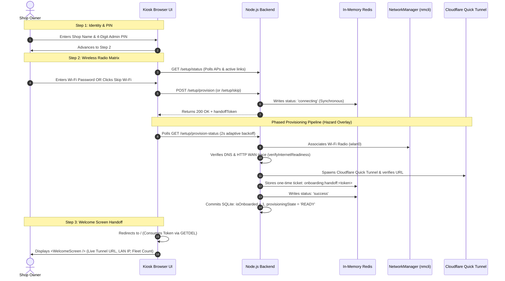

# Onboarding Flow & System Handoff — Visual UI Report

This visual design and UI report documents the entire onboarding sequence of the automated print terminal, including all user-facing setup screens, interactive modals, phased loading hazard overlays, and the post-reconnection Welcome handoff screen.

The interface adheres strictly to the **Warm Industrial Printshop** aesthetic tokens: Cast Iron base (`#1A1D20`), Machined Slate surfaces (`#24282D`), Paper Table sheets with perforation holes (`#2D3238`), Safety Orange (`#FF5500`) and Press Cyan (`#00A396`) accents, extruded 3D mechanical buttons, and pulsing hardware LED diodes.

---

## Complete User Journey Architecture



---

## 1. Step 1: Identity & Security (`Step1NameAndPin.tsx`)

The initial boot screen prompts the shop owner to establish terminal identity and configure their master administrative PIN.


### UI Layout Specification
```
┌────────────────────────────────────────────────────────────────────────┐
│ 🟢 SYSTEM_PROVISIONING // TERMINAL_INITIALIZATION         [STEP 01/02] │
├──────────────────────────────────────┬─────────────────────────────────┤
│ [1. IDENTITY & SECURITY] (Active)    │  2. NETWORK PROVISIONING        │
└──────────────────────────────────────┴─────────────────────────────────┘
│                                                                        │
│  [SHOP_IDENTITY_TAG]                                                   │
│  ┌──────────────────────────────────────────────────────────────────┐  │
│  │ MODERN PRESS                                                     │  │
│  └──────────────────────────────────────────────────────────────────┘  │
│  This name will appear on the public print kiosk and customer receipts.│
│                                                                        │
│  [MASTER_ADMIN_SECURITY_PIN]                                           │
│  ┌──────────────────────────────────────────────────────────────────┐  │
│  │ [ • ] [ • ] [ • ] [ • ]                                          │  │
│  └──────────────────────────────────────────────────────────────────┘  │
│  ⚠ Set a 4-digit PIN to access pricing, fleet management, & refunds.   │
│                                                                        │
│  ┌──────────────────────────────────────────────────────────────────┐  │
│  │ [ CONTINUE TO STEP 2: NETWORK PROVISIONING ➔ ]                   │  │
│  └──────────────────────────────────────────────────────────────────┘  │
└────────────────────────────────────────────────────────────────────────┘
```

* **Header Strip**: Dark slate backing with a glowing emerald LED diode (`#00C853`) and monospaced title tag.
* **Stepper Tabs**: High-contrast active tab indicator with Safety Orange border accent (`#FF5500`).
* **Input Fields**: Machined slate background with inset shadows and 2px orange focus border glow.
* **Action Button**: Full-width extruded 3D mechanical button (`.btn-mechanical`) with 3px physical click depression.

---

## 2. Step 2: Wireless Provisioning Matrix (`Step2WifiSetup.tsx`)

Displays real-time wireless telemetry, active links, swept access points, and the skip-provisioning security gate.

### UI Layout Specification
```
┌────────────────────────────────────────────────────────────────────────┐
│ 🟢 SYSTEM_PROVISIONING // TERMINAL_INITIALIZATION         [STEP 02/02] │
├──────────────────────────────────────┬─────────────────────────────────┤
│ 1. IDENTITY & SECURITY [✓]           │ [2. NETWORK PROVISIONING] (🟡) │
└──────────────────────────────────────┴─────────────────────────────────┘
│                                                                        │
│  WI-FI_RADIO_PROVISIONING                         [ REFRESH SCAN ↻ ]   │
│  ┈┈┈┈┈┈┈┈┈┈┈┈┈┈┈┈┈┈┈┈┈┈┈┈┈┈┈┈┈┈┈┈┈┈┈┈┈┈┈┈┈┈┈┈┈┈┈┈┈┈┈┈┈┈┈┈┈┈┈┈┈┈┈┈┈┈┈┈  │
│                                                                        │
│  ┌──────────────────────────────────────────────────────────────────┐  │
│  │ 🟢 PrintShop_Primary_5G                       [ACTIVE_LINK]      │  │
│  │    ACTIVE LINK // 88% SIGNAL                                     │  │
│  └──────────────────────────────────────────────────────────────────┘  │
│                                                                        │
│  AVAILABLE_NETWORKS_MATRIX                                             │
│  ╔══════════════════════════════════════════════════════════════════╗  │
│  ║ 🟡 FrontDesk_Guest    [SAVED_PROFILE]    [ ████░░░░ ] 72%  [SEL] ║  │
│  ║ 🟡 Studio_HighSpeed                      [ ██████░░ ] 90%  [SEL] ║  │
│  ║ 🟡 Warehouse_Mesh                        [ ██░░░░░░ ] 45%  [SEL] ║  │
│  ╚══════════════════════════════════════════════════════════════════╝  │
│                                                                        │
│  ┌──────────────────────────────────────────────────────────────────┐  │
│  │ [ PROCEED WITH CURRENT ACTIVE NETWORK (SKIP WI-FI SETUP) ➔ ]     │  │
│  └──────────────────────────────────────────────────────────────────┘  │
└────────────────────────────────────────────────────────────────────────┘
```

* **Active Link Plate**: Surrounded by an emerald green border (`rgba(0, 200, 83, 0.08)` fill) with an active link badge.
* **Paper Table Matrix**: Renders with tractor-feed perforation margins, monospaced network names, saved profile tags, and discrete ASCII-style signal gauges (`[ ████░░░░ ] 72%`).
* **Conditional Skip Button**: Strictly gated to `RECOVERY` mode, allowing instantaneous continuation if an active connection already exists.

---

## 3. Wi-Fi Authentication Modal (`WifiConnectModalBody.tsx`)

Opened when selecting a wireless access point to configure security credentials.

```
       ┌───────────────────────────────────────────────────┐
       │ CONNECT_TO: [Studio_HighSpeed]                [✕] │
       ├───────────────────────────────────────────────────┤
       │                                                   │
       │  SECURITY_PROTOCOL: WPA2 / WPA3 PERSONAL          │
       │                                                   │
       │  [WPA2_PASSPHRASE]                                │
       │  ┌─────────────────────────────────────────────┐  │
       │  │ ••••••••••••••••                        [👁] │  │
       │  └─────────────────────────────────────────────┘  │
       │  Enter the wireless network security passphrase.  │
       │                                                   │
       │  ┌──────────────┐  ┌───────────────────────────┐  │
       │  │ [ CANCEL ]    │  │ [ AUTHENTICATE & LINK ➔ ] │  │
       │  └──────────────┘  └───────────────────────────┘  │
       └───────────────────────────────────────────────────┘
```

---

## 4. Phased Provisioning Hazard Overlay (Loading States)

Triggered immediately upon credential submission or network skip. This multi-phase hazard overlay keeps the user informed through all hardware radio cycles, WAN verification checks, and remote tunnel launches.


### Visual Progression Across Sub-Phases

````carousel
```
┌─────────────────────────────────────────────────────────────────────────┐
│ 🟡 [ APPLYING_NETWORK_CREDENTIALS ]                                     │
│ ┈┈┈┈┈┈┈┈┈┈┈┈┈┈┈┈┈┈┈┈┈┈┈┈┈┈┈┈┈┈┈┈┈┈┈┈┈┈┈┈┈┈┈┈┈┈┈┈┈┈┈┈┈┈┈┈┈┈┈┈┈┈┈┈┈┈┈┈┈┈┈ │
│ The kiosk terminal is cycling its wireless radio to join [Office-5G].   │
│ Please wait while authentication completes.                             │
│                                                                         │
│ [ ██░░░░░░░░░░░░░░░░░░ ] 10% (CONNECTING_WIFI)                         │
└─────────────────────────────────────────────────────────────────────────┘
```
<!-- slide -->
```
┌─────────────────────────────────────────────────────────────────────────┐
│ 🟡 [ VERIFYING_WAN_CONNECTIVITY ]                                       │
│ ┈┈┈┈┈┈┈┈┈┈┈┈┈┈┈┈┈┈┈┈┈┈┈┈┈┈┈┈┈┈┈┈┈┈┈┈┈┈┈┈┈┈┈┈┈┈┈┈┈┈┈┈┈┈┈┈┈┈┈┈┈┈┈┈┈┈┈┈┈┈┈ │
│ Wi-Fi association confirmed. Validating DNS resolution and secure       │
│ HTTPS gateway communication...                                          │
│                                                                         │
│ [ ████████░░░░░░░░░░░░ ] 45% (DNS_TRACE_OK)                            │
└─────────────────────────────────────────────────────────────────────────┘
```
<!-- slide -->
```
┌─────────────────────────────────────────────────────────────────────────┐
│ 🟢 [ ESTABLISHING_REMOTE_TUNNEL ]                                       │
│ ┈┈┈┈┈┈┈┈┈┈┈┈┈┈┈┈┈┈┈┈┈┈┈┈┈┈┈┈┈┈┈┈┈┈┈┈┈┈┈┈┈┈┈┈┈┈┈┈┈┈┈┈┈┈┈┈┈┈┈┈┈┈┈┈┈┈┈┈┈┈┈ │
│ Provisioning encrypted Cloudflare Quick Tunnel for customer access      │
│ and remote dashboard telemetry...                                       │
│                                                                         │
│ [ ████████████████░░░░ ] 80% (EDGE_CERT_NEGOTIATED)                     │
└─────────────────────────────────────────────────────────────────────────┘
```
<!-- slide -->
```
┌─────────────────────────────────────────────────────────────────────────┐
│ 🟡 [ NETWORK_TRANSITION_IN_PROGRESS ]                                   │
│ ┈┈┈┈┈┈┈┈┈┈┈┈┈┈┈┈┈┈┈┈┈┈┈┈┈┈┈┈┈┈┈┈┈┈┈┈┈┈┈┈┈┈┈┈┈┈┈┈┈┈┈┈┈┈┈┈┈┈┈┈┈┈┈┈┈┈┈┈┈┈┈ │
│ The terminal is switching network interfaces. If disconnected from the  │
│ temporary hotspot, reconnect to your local Wi-Fi. Keep this open.       │
│                                                                         │
│ [ ██████████████████░░ ] 90% (RESILIENT_BACKOFF_ACTIVE)                 │
└─────────────────────────────────────────────────────────────────────────┘
```
````

---

## 5. First-Visit Welcome Handoff Screen (`WelcomeScreen.tsx`)

Rendered **only once** upon successful post-reconnection boot via the consumed one-time Redis ticket.


### UI Layout Specification
```
┌────────────────────────────────────────────────────────────────────────┐
│ 🟢 TERMINAL_PROVISIONED // SYSTEM_READY                       [ONLINE] │
├────────────────────────────────────────────────────────────────────────┤
│                                                                        │
│                             🛡️                                        │
│                     [ MODERN PRESS ]                                   │
│    Kiosk hardware, identity tokens, and secure remote gateways are     │
│                   fully provisioned and operational.                   │
│                                                                        │
│  ┌──────────────────────────────────────────────────────────────────┐  │
│  │ 🌐 [1] PUBLIC_REMOTE_ACCESS_ENDPOINT                          🟢 │  │
│  │ ┌──────────────────────────────────────────────────────────────┐ │  │
│  │ │ https://modern-press.trycloudflare.com                       │ │  │
│  │ └──────────────────────────────────────────────────────────────┘ │  │
│  │                                          [ OPEN REMOTE ACCESS ↗] │  │
│  └──────────────────────────────────────────────────────────────────┘  │
│                                                                        │
│  ┌──────────────────────────────────────────────────────────────────┐  │
│  │ 📶 [2] LOCAL_NETWORK_GATEWAY                                  🟢 │  │
│  │ ┌──────────────────────────────────────────────────────────────┐ │  │
│  │ │ http://192.168.1.145:3000                                    │ │  │
│  │ └──────────────────────────────────────────────────────────────┘ │  │
│  │                                           [ OPEN LOCAL ACCESS ↗] │  │
│  └──────────────────────────────────────────────────────────────────┘  │
│                                                                        │
│  ┌──────────────────────────────────────────────────────────────────┐  │
│  │ 🖨️ HARDWARE_FLEET // 2 PRINTERS DETECTED                          │  │
│  │   Printers are registered and ready to receive customer jobs.    │  │
│  └──────────────────────────────────────────────────────────────────┘  │
│                                                                        │
│  ┌──────────────────────────────────────────────────────────────────┐  │
│  │ [ GO TO ADMIN CONTROL ROOM ➔ ]                                   │  │
│  └──────────────────────────────────────────────────────────────────┘  │
│  ┌──────────────────────────────────────────────────────────────────┐  │
│  │ [ OPEN CUSTOMER PRINT KIOSK ]                                    │  │
│  └──────────────────────────────────────────────────────────────────┘  │
└────────────────────────────────────────────────────────────────────────┘
```

* **Remote Cloudflare Card**: Directly exposes the public edge URL with a one-click launcher (`[ OPEN REMOTE ACCESS ↗ ]`).
* **Local LAN Card**: Displays the Raspberry Pi's local network IPv4 address with launcher (`[ OPEN LOCAL ACCESS ↗ ]`).
* **Fleet Telemetry**: Informs the owner of attached CUPS printer hardware.
* **Dual Action Buttons**: Quick-route buttons to enter the password-protected **Admin Control Room** (`/admin`) or launch the **Customer Kiosk** (`/`).

---

## 6. Design System Tokens Applied

| Token | CSS Variable | Hex Value | Usage |
|---|---|---|---|
| **Base Canvas** | `--bg-primary` | `#1A1D20` | Fullscreen background canvas |
| **Machined Surface** | `--bg-surface` | `#24282D` | Cards, consoles, modals |
| **Paper Table** | `--bg-paper` | `#2D3238` | Telemetry tables & AP matrices |
| **Safety Orange** | `--accent-primary` | `#FF5500` | Active borders, progress bars, highlights |
| **Press Cyan** | `--accent-secondary`| `#00A396` | Cloudflare tags, telemetry metrics |
| **Hardware LED Green** | `--status-idle` | `#00C853` | Online, verified, active links |
| **Hardware LED Amber** | `--status-busy` | `#FFAB00` | Connecting, scanning, transitions |
| **Hardware LED Red** | `--status-error`| `#D50000` | Failures, offline alerts |
| **Display Font** | `var(--font-mono)` | `IBM Plex Mono` | Headers, badges, bracketed tags, code |
| **Body Font** | `var(--font-body)` | `Space Grotesk` | Explanatory text, labels, instructions |
