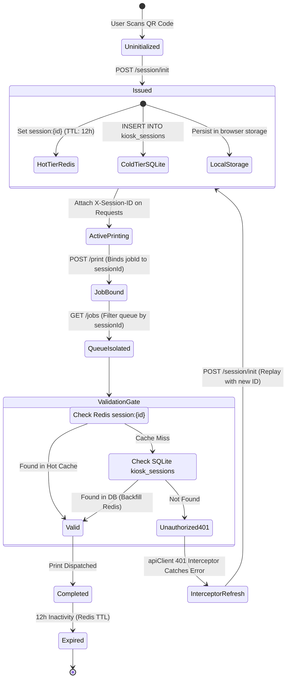

# Customer Session ID: Complete Lifecycle & Architecture Report

## 1. Architectural Purpose & Philosophy

In the **Printing Automation Ecosystem**, customer smartphones interact with a shared physical kiosk via Cloudflare Edge Tunnels or local mDNS (`http://piprint.local:3000/`). 

The **Session ID** subsystem was engineered to satisfy three core requirements:
1. **Zero-Friction Anonymous Printing**: Customers do not create accounts, passwords, or verify emails. They scan the QR code and are immediately ready to print.
2. **Multi-Tenant Privacy & Job Isolation**: If 5 customers stand near the kiosk and queue jobs simultaneously, **Customer A must never see Customer B's documents, filenames, or costs**. The Session ID serves as a cryptographic boundary.
3. **Decoupled Stateless Architecture**: The physical 5-inch display is completely decoupled from customer uploads; customer state lives entirely in their own session sandbox.

---

## 2. End-to-End Lifecycle State Machine



---

## 3. The 6 Phases of the Session ID Lifecycle

### Phase 1: Generation & Registration (Birth)
When a customer lands on the customer portal (`/`):
* **Endpoint**: `POST /session/init` ([`session.controller.ts`](file:///c:/Users/narendra/Desktop/documents/web%20Development%20Programming/Printing_ecosystem/Printing_automation/server/src/app/controllers/session.controller.ts))
* **Handler**: [`session.service.ts`](file:///c:/Users/narendra/Desktop/documents/web%20Development%20Programming/Printing_ecosystem/Printing_automation/server/src/app/services/session.service.ts) generates a RFC4122 v4 UUID:
  ```ts
  const sessionId = randomUUID();
  ```
* **Dual-Tier Persistence**:
  1. **Hot Tier (Redis)**: Written to `session:<sessionId>` with a **12-hour TTL** (`REDIS_TTLS.SESSION = 43200` seconds).
  2. **Cold Tier (SQLite)**: Persisted in `kiosk_sessions` with `ip_address`, `user_agent`, and `created_at`.
* **Client Handshake**: The browser receives `{ success: true, sessionId }` and stores it in Zustand store (`useUserPrintStore.ts`), which automatically writes it to `localStorage` under `user_print_storage`.

---

### Phase 2: Propagation & Transport
Once issued, the browser carries the Session ID on every interaction without customer intervention:
* **HTTP Headers**: In [`apiClient.ts`](file:///c:/Users/narendra/Desktop/documents/web%20Development%20Programming/Printing_ecosystem/Printing_automation/admin-ui/src/services/apiClient.ts#L21-L25), `getAuthHeaders()` injects:
  ```http
  X-Session-ID: 3a2f8c5e-8841-4702-8f1b-586b36cf5479
  ```
* **Multipart Uploads**: In `POST /print`, `formData.append('sessionId', sessionId)`.
* **Queue Queries**: In `GET /jobs?sessionId=<sessionId>`.
* **WebSocket Isolation**: WebSockets events (`job_queued`, `job_active`, `job_completed`, `job_failed`) carry `sessionId` payloads so only the submitting browser triggers completion toasts.

---

### Phase 3: Verification & Security Gate
When any customer request hits the server (such as viewing the queue):
* **Controller Inspection**: [`jobs.controller.ts`](file:///c:/Users/narendra/Desktop/documents/web%20Development%20Programming/Printing_ecosystem/Printing_automation/server/src/app/controllers/jobs.controller.ts#L22-L48) evaluates the caller:
  ```ts
  const sessionId = req.headers["x-session-id"] || req.query.sessionId;
  ```
* **Tiered Lookup**:
  1. **Redis Cache First**: Reads `session:<sessionId>`. If active, access is granted in **<1ms**.
  2. **SQLite Database Fallback**: If Redis was restarted or cold, queries `SELECT session_id FROM kiosk_sessions WHERE session_id = ?`. If found, it re-hydrates Redis with 12h TTL and grants access.
  3. **Rejection**: If absent in both layers, the request is rejected with `401 Unauthorized` (`SESSION_INVALID`).

---

### Phase 4: Job Binding & Queue Isolation (Workhorse)
When the customer confirms a print in Step 3 (`QuoteReceipt`):
1. **Database Binding**: `print.controller.ts` inserts the record into SQLite:
   ```sql
   INSERT INTO print_jobs (id, session_id, filename, pages, copies, color_mode, duplex, cost, status)
   VALUES (?, ?, ?, ?, ?, ?, ?, ?, 'queued');
   ```
   *(Enforced by foreign key: `FOREIGN KEY (session_id) REFERENCES kiosk_sessions(session_id)`)*.
2. **Queue Tagging**: In BullMQ (`printMaster.queue.ts`), the job payload in Redis stores `job.data.sessionId`.
3. **Queue Privacy Filtering**:
   When the customer loads Step 4 (`JobTracker`), [`job.service.ts`](file:///c:/Users/narendra/Desktop/documents/web%20Development%20Programming/Printing_ecosystem/Printing_automation/server/src/app/services/job.service.ts#L43-L47) pulls all queue states (waiting, active, delayed, completed) and applies an absolute filter:
   ```ts
   if (sessionId) {
     allJobs = allJobs.filter((j) => j.sessionId === sessionId);
   }
   ```
   **Result**: Customer A only sees their own documents. Admin tokens bypass this filter to view the global fleet queue.

---

### Phase 5: Self-Healing & The 401 Refresh Interceptor
If a customer leaves their browser tab open for days and the session expires, the frontend recovers gracefully using the **JWT Refresh Token pattern** in [`apiClient.ts`](file:///c:/Users/narendra/Desktop/documents/web%20Development%20Programming/Printing_ecosystem/Printing_automation/admin-ui/src/services/apiClient.ts#L84-L117):

1. **401 Interception**: An API call receives `401 SESSION_INVALID`.
2. **Request Queueing**: Subsequent concurrent requests are suspended and added to `refreshSubscribers`.
3. **Re-Initialization**: The interceptor silently executes:
   ```ts
   const initRes = await fetch(`${BASE_URL}/session/init`, { method: 'POST' });
   ```
4. **State Update**: Updates Zustand store:
   ```ts
   useUserPrintStore.setState({ sessionId: newSessionId });
   ```
5. **Request Replay**: Flushes the subscriber queue and replays the original failed requests with the new session ID.

---

### Phase 6: Expiration & Cleanup (Death)
1. **Redis Auto-Eviction**: After 12 hours of inactivity, Redis automatically purges `session:<sessionId>` from memory.
2. **SQLite Cold Storage**: The record in `kiosk_sessions` remains as an immutable audit log linking back to completed jobs in `print_jobs`.
3. **Client-Side Reset**: If the customer remains inactive for 10 minutes, the customer portal automatically calls `reset()`, clearing previews and resetting the wizard to Step 1 (`DropZone`).

---

## 4. Key Takeaways & Identified Fix

| Component | Responsibility | Status |
| :--- | :--- | :--- |
| **`POST /session/init`** | Issues server-signed UUIDs to Redis & SQLite | Active & Working |
| **`kiosk_sessions`** | SQLite storage for session audit and fallback | Active & Working |
| **`Redis session:{id}`** | Sub-millisecond queue authorization cache (12h TTL) | Active & Working |
| **`jobs.controller.ts`** | Blocks unauthorized queue access without valid session | Active & Working |
| **`apiClient.ts` Interceptor** | Auto-refreshes expired sessions via `POST /session/init` | Active |
| **Identified Fix** | 1. Ensure `POST /print` auto-registers session in SQLite/Redis.<br>2. Pass session via `X-Session-ID` header instead of hardcoded URL query string so interceptor retries succeed cleanly.<br>3. Guard `JobTracker.tsx` so missing fields never trigger React crash screens. | Ready to Apply |